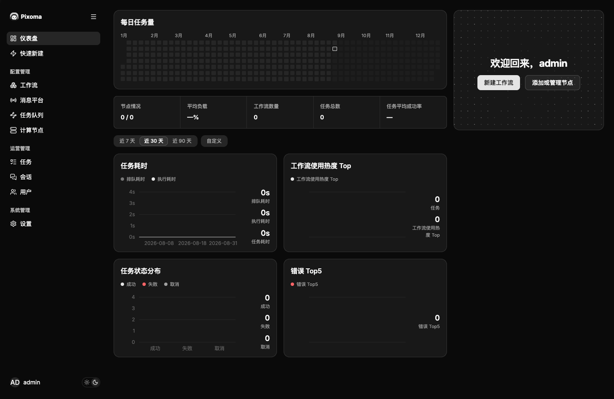
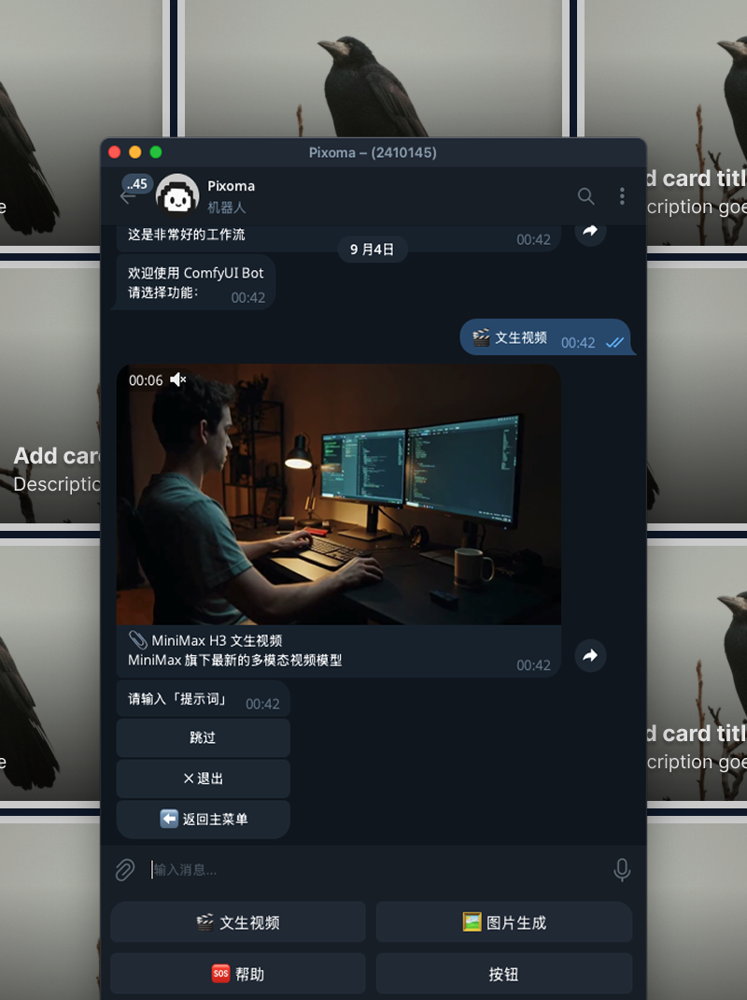
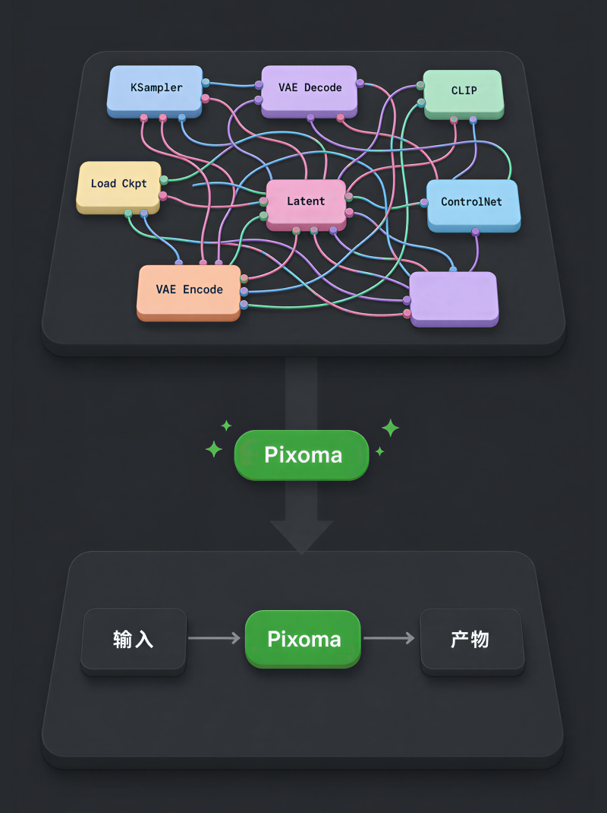

<p align="center">
  
</p>

<h1 align="center">Pixoma</h1>

<p align="center">
  把 ComfyUI 变成 Telegram Bot。自托管，多节点调度，随时随地出图。
</p>

<p align="center">
  <a href="#安装"><b>安装</b></a>
  ·
  <a href="#快速开始"><b>快速开始</b></a>
  ·
  <a href="#功能"><b>功能</b></a>
  ·
  <a href="#faq"><b>FAQ</b></a>
</p>

<p align="center">
  <a href="https://github.com/Mr9esx/Pixoma/stargazers">
    
  </a>
  <a href="LICENSE">
    
  </a>
</p>

## 截图

| 管理后台 | Telegram Bot |
| :---: | :---: |
| <a href="web/landing/public/images/app-dashboard-dark.png"></a> | <a href="web/landing/public/images/telegram-bot-dark.png"></a> |

| 工作流简化 |
| :---: |
| <a href="web/landing/public/images/simplify-dark.png"></a> |

## Pixoma 是什么

Pixoma 把你已有的 ComfyUI 工作流包装成 Telegram Bot，让你在手机上也能随时调用。工作流、节点、任务队列、存储，全部自托管。

- 单机跑：一台电脑，Pixoma + ComfyUI 都在本地
- 多节点：Pixoma 跑在一台机器上，GPU 节点上跑 agent 主动领任务
- 支持文生图、文生视频、图片编辑、图生视频、TTS、人声模仿等任何 ComfyUI 工作流

## 功能

### Telegram Bot 对话式生成

- `/start` 主菜单，按分类浏览 Case
- 对话式填写参数，可选字段可跳过
- 生成进度推送，完成后 Bot 直接返回结果
- 多 Session 并行，互不干扰

### 工作流管理

- 导入 ComfyUI 工作流，配置输入输出节点
- 三段式简化：输入 → 生成 → 输出，隐藏复杂节点
- Case 分组管理，支持启用/停用
- 内置可视化工作流编辑器

### 多计算节点调度

- 计算节点通过长轮询领任务，无需 Redis
- 支持 Topic 路由，不同节点接不同类型任务
- 节点状态、负载、指标实时监控
- 单机 all-in-one 或云端多节点自由切换

### 存储与数据库

- 对象存储：本地目录 / S3 / TOS / 共享目录（SMB / NFS）
- 数据库：SQLite（默认）/ MySQL / Postgres
- 初始化向导一键配置，支持连通性测试

### 管理后台

- RBAC 权限：viewer / operator / admin
- 任务列表、详情、重试
- 节点管理、Case 管理、用户管理
- 任务统计、节点指标图表
- 支持亮/暗主题

### 安全

- 会话鉴权 + CSRF 防护
- 数据目录 `0700` / `0600` 权限
- 敏感配置加密存储
- 支持 HTTPS 反向代理

## 安装

macOS / Linux：

```bash
curl -fsSL https://pixoma.miaoplus.com/install.sh | sh
pixoma
```

Windows PowerShell：

```powershell
irm https://pixoma.miaoplus.com/install.ps1 | iex
pixoma
```

源码运行：

```bash
go run ./apps/pixoma/cmd/pixoma
```

## 快速开始

1. 启动 `pixoma`，日志里找到后台地址和默认管理员密码
2. 浏览器打开后台，登录后走初始化向导：改密 → 选数据库 → 选对象存储 → 加节点 → 填 Telegram Bot Token
3. 在有 ComfyUI 的机器上，按后台「节点部署命令」运行 `pixoma-edge-agent`
4. 后台 → Case → 导入你的 ComfyUI 工作流
5. Telegram 里找到你的 Bot，`/start` 开始生成

> 保存配置后需要重启 `pixoma` 才会生效。

## 它是怎么工作的

```
Telegram 用户 ──► 对话 Session ──► 生成任务
                                      │
                                Pixoma 服务
                           （调度 / 管理后台 / API）
                                      │
                           任务队列 + 长轮询领任务
                                      │
                            计算节点 Agent
                                      │
                                   ComfyUI
```

计算节点不被动等待推送，而是主动向 Pixoma 服务发起长轮询请求，有任务就领走执行。这样部署最简单：GPU 机器只要能访问到 Pixoma 服务就行，不需要公网 IP。

### 两种部署方式

| | 单机 | 多节点 |
|---|---|---|
| Pixoma 服务 | 本地 | 服务器（公网 IP / 域名） |
| 计算节点 | 同一台机器 | 多台 GPU 机器 |
| 对象存储 | 本地目录 | S3 / TOS |
| 适合 | 个人使用 | 团队 / 多卡 / 弹性扩容 |

## 配置

主要环境变量：

| 变量 | 说明 | 默认值 |
|---|---|---|
| `DATA_DIR` | 数据目录（SQLite / blob） | `data` |
| `HTTP_ADDR` | 监听地址 | `127.0.0.1:8080` |
| `DB_DRIVER` / `DATABASE_DSN` | 数据库驱动与 DSN | `sqlite` / `DATA_DIR/app.db` |
| `BLOB_DRIVER` | 对象存储驱动：`localfs` / `s3` / `tos` / `sharedfs` | `localfs` |
| `TG_BOT_TOKEN` | Telegram Bot Token | — |
| `EDGE_ID` | 计算节点 ID（agent 端） | — |
| `AGENT_TOKEN` | 计算节点 Token（agent 端） | — |
| `CONTROL_PLANE_URL` / `PIXOMA_URL` | Pixoma 服务地址（agent 端） | — |
| `COMFYUI_BASE_URL` | ComfyUI 地址 | — |
| `CLAIM_WAIT` | 长轮询等待时间（agent 端） | `5s` |
| `STATS_TIMEZONE` | 统计归天时区 | `Asia/Shanghai` |
| `PIXOMA_ENCRYPTION_KEY` | 加密密钥，建议自行设置长随机值 | 内置 |

完整列表见 [`docs/install.md`](docs/install.md)。

## FAQ

**Pixoma 自带 ComfyUI 吗？**

不带。Pixoma 是在你已有的 ComfyUI 基础上加一层 Bot 接口和调度，需要你先有能正常跑的 ComfyUI 和工作流。

**单机部署需要什么？**

一台能跑 ComfyUI 的电脑就行。SQLite + 本地文件存储，零外部依赖。需要能访问 Telegram。

**用云端 GPU 节点需要什么准备？**

1. Pixoma 服务部署在有公网 IP 或域名的服务器
2. 对象存储用 S3 或 TOS（不能用本地目录）
3. GPU 机器上运行 `pixoma-edge-agent`，能访问到 Pixoma 服务

**支持哪些 ComfyUI 节点？**

所有节点都支持。Pixoma 不关心工作流里用了什么节点，只负责把输入参数填进去、把输出结果取出来。

**旧版 Redis split 能升级吗？**

不保证原地升级。新版默认走 Pixoma 服务 + 向导 + 节点长轮询，不再依赖 Redis。

## 开发

```bash
make dev        # Pixoma 服务 + Vite 管理页面（热更新）
make run        # 只起后端
make build      # 构建二进制
make test       # 运行测试
make clean      # 清空 data/，下次启动重新走引导
```

`make dev` 启动后：
- 管理页面：`http://127.0.0.1:5173`
- 后端 API：`http://127.0.0.1:8080`

更多开发文档见 [`docs/architecture/`](docs/architecture/)。

## 贡献

[`CONTRIBUTING.md`](CONTRIBUTING.md)

安全问题请见 [`SECURITY.md`](SECURITY.md)，不要公开提 issue。

## License

[`LICENSE`](LICENSE)
