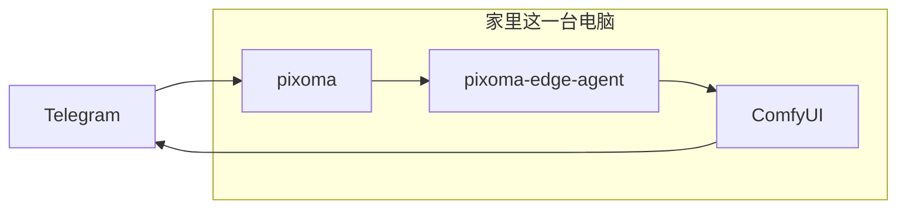
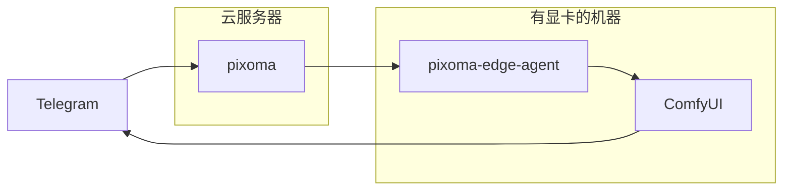
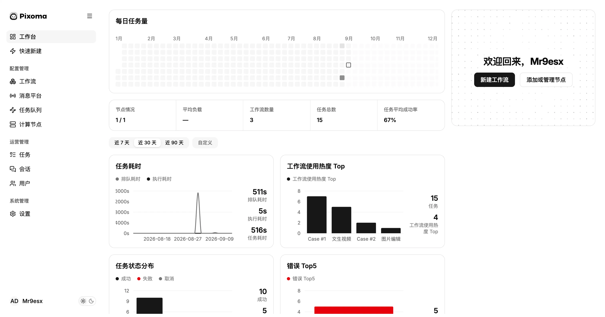
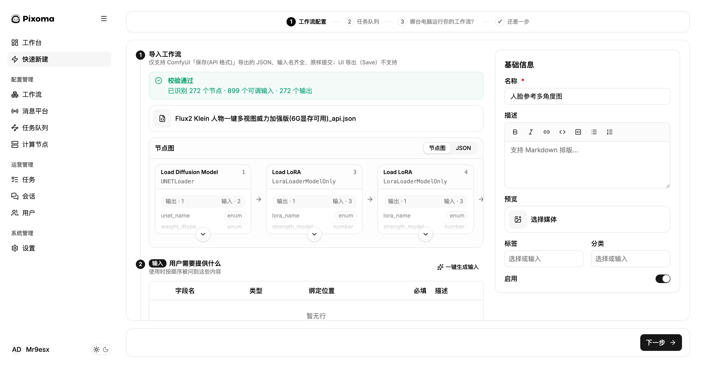
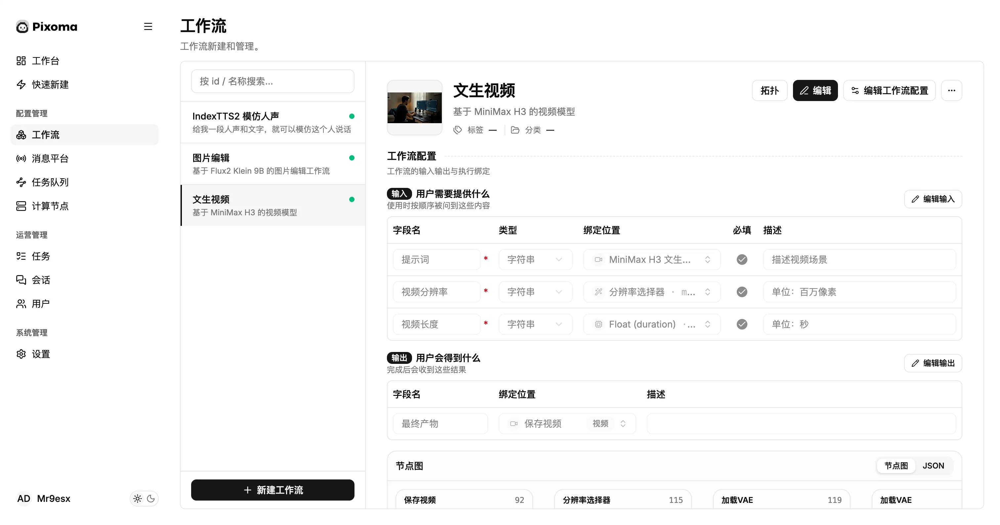
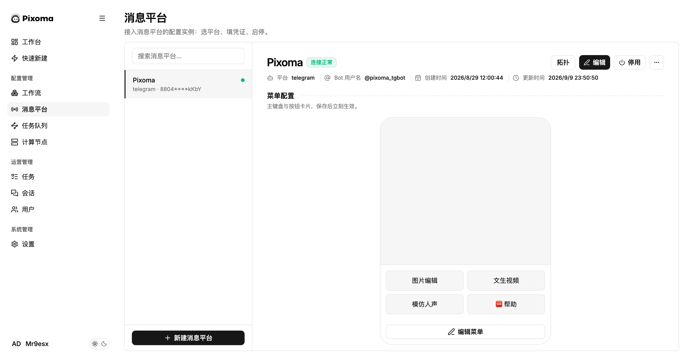
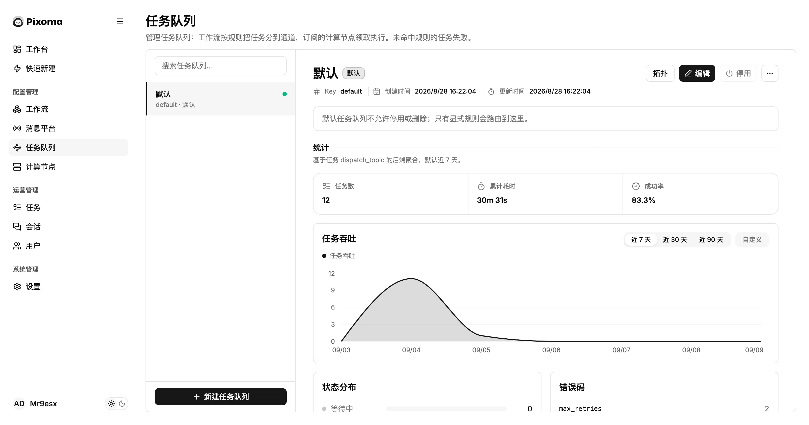
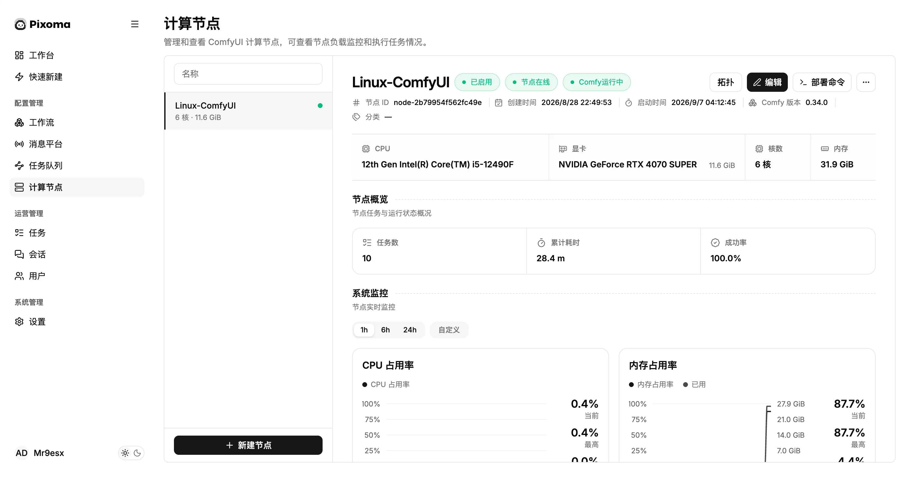
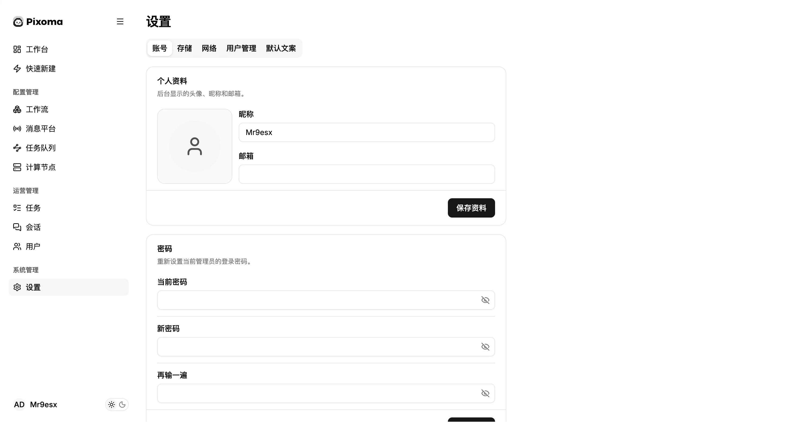
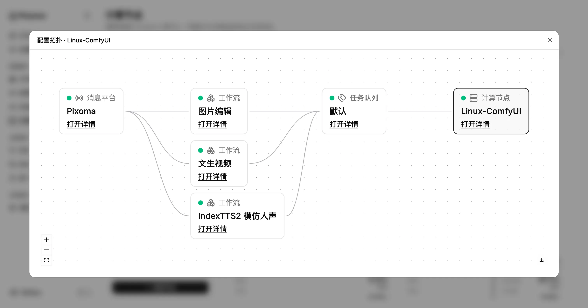

<p align="center">
  
  <br/>
  
  
  <br/>
  <i>
    <samp>创意不设限</samp>
  </i>
</p>

<br/>

这是一套可通过 Telegram、飞书、MCP 调用 ComfyUI 工作流的服务，让你随时随地将灵感转化为作品。

<br/>


<br/>

<p align="center">
  
  
  
  
  
  
  
  
  
  
  
</p>

<p align="center">
  
  
</p>

<p align="left"><sub><em>P.S: 飞书、MCP 等能力开发中</em></sub><p/>

## 简介

开发这个服务的初衷是：我家里有一台配置不错的电脑，平时常用 ComfyUI 搭建各类工作流，用来生成图片、制作视频。

但 ComfyUI 有个痛点 —— 外出的时候很难直接使用。

过去一般只有两种方案：

- 折腾内网穿透，通过静态 IP、DDNS 等方式，在外访问家里的设备；

- 购买云服务器自行部署 ComfyUI，或是使用 RunningHub 这类云端平台。

可家里明明已经有性能够用的主机，没必要额外花钱租用服务器，或是订阅付费平台，而且通常这些平台会有很多审查机制。

除此之外还有个麻烦：ComfyUI 复杂的工作流操作界面，在手机等移动设备上操作体验很差。

正是为了解决这些难题，我着手开始制作 Pixoma。

## 它能做什么

- 接入 Telegram、飞书 等 IM 工具，可以直接通过对话调用 ComfyUI 工作流，并查看成品。
- 提供 MCP 工具，方便 AI 对话工具直接调用。

Pixoma 最大优点是：

最小化部署的情况下，只需要一台可以正常运行 ComfyUI 的电脑，不需要任何域名和服务器，只需要你的电脑可以正常访问互联网，即可接入 Telegram 等 IM 软件在外使用。

> P.S: 如果你需要通过 Telegram 去使用，这里正常访问互联网指的是 “全世界的公网网站都能畅通无阻”。

## 它怎么工作

Pixoma 支持两种部署方案：

### 方案一：单机部署（全部跑在家里同一台电脑）



pixoma、pixoma-edge-agent、ComfyUI 全部部署在同一台本地电脑上。

方案二：分离部署（云端控制面 + 云端 GPU 算力机）



pixoma 部署在云服务器；pixoma-edge-agent 与 ComfyUI 运行在带显卡的机器上。
GPU 算力机**不需要公网 IP**，只要可以访问云服务器即可。

### 执行流程

1. 在对话中选择工作流，填写所需参数，确认提交生成任务。
2. pixoma 接收并记录任务。
3. pixoma-edge-agent 获取任务，转发给对应机器上的 ComfyUI 执行。
4. 任务完成后，生成的图片或视频自动发送回原对话。

## 安装

macOS / Linux：

```bash
curl -fsSL https://pixoma.miaoplus.com/install.sh | sh
pixoma
```

Windows PowerShell：

```powershell
irm https://pixoma.miaoplus.com/install.ps1 | iex
pixoma
```

## 预览

<table>
<tr>
<td valign="top" width="50%">

**工作台**

- 查看任务量、成功率与执行耗时
- 监控计算节点在线状态
- 快捷入口：新建工作流、管理计算节点

</td>
<td valign="top" width="50%">



</td>
</tr>
<tr>
<td valign="top" width="50%">

**快速新建工作流**

- 导入 ComfyUI 工作流 JSON
- 配置输入项、输出规则与后处理流程
- 选择执行算力机器，发布到聊天菜单

</td>
<td valign="top" width="50%">



</td>
</tr>
<tr>
<td valign="top" width="50%">

**工作流**

- 列表浏览、新建、编辑、启停管理
- 绑定用户输入 / 输出字段至 ComfyUI 节点
- 预览节点画布，配置处理逻辑

</td>
<td valign="top" width="50%">



</td>
</tr>
<tr>
<td valign="top" width="50%">

**消息平台**

- 接入 Telegram，填写 Bot Token
- 查看连接状态，支持启停
- 配置 Bot 菜单与提示文案

</td>
<td valign="top" width="50%">



</td>
</tr>
<tr>
<td valign="top" width="50%">

**任务队列**

- 创建队列并绑定计算节点
- 按规则将工作流任务分配至队列
- 监控吞吐、成功率与错误日志

</td>
<td valign="top" width="50%">



</td>
</tr>
<tr>
<td valign="top" width="50%">

**计算节点**

- 新建节点，一键复制部署命令
- 订阅任务队列；检测节点在线状态、ComfyUI 服务健康
- 查看硬件信息及 CPU / 内存 / GPU 实时占用

</td>
<td valign="top" width="50%">



</td>
</tr>
<tr>
<td valign="top" width="50%">

**设置**

- 账号密码管理
- 存储配置：本地目录 / S3 / TOS
- 网络代理、用户权限、默认提示文案

</td>
<td valign="top" width="50%">



</td>
</tr>
<tr>
<td valign="top" width="50%">

**配置拓扑**

- 可视化查看消息平台、工作流、任务队列、计算节点之间的关联关系
- 点击组件直接打开详情页

</td>
<td valign="top" width="50%">



</td>
</tr>
</table>

## 常见问题

### Q：需要先安装 ComfyUI 吗？

A：需要。你要先在电脑部署好可正常运行的 ComfyUI 与对应工作流，再安装 Pixoma。Pixoma 不会帮你安装 ComfyUI。

### Q：家里电脑没有公网 IP、也没有域名，在外也能使用吗？

A：可以。只要设备能正常联网、能访问 Telegram 即可，**无需配置内网穿透，也不用额外购买云服务器**。

### Q：在聊天里需要填写工作流全部节点参数吗？

A：不用。工作流节点一次性配置完成后基本无需改动。你只需要在对话中填写核心参数，例如产品图、场景描述、图像尺寸等。

### Q：生成的图片会上传到第三方服务器吗？

A：默认不会。全部生成任务都在你本地这台装有 ComfyUI 的电脑上执行。

### Q：支持哪些 ComfyUI 节点？

A：只要该工作流能在你的 ComfyUI 正常运行，Pixoma 就可以调用。Pixoma 不会限制节点类型。

## 开发

需要 Go 1.25+、Node.js 22+、pnpm。

```bash
make dev        # pixoma + Vite 管理页
make run        # 只起控制面
make build      # bin/pixoma 和 bin/pixoma-edge-agent
make test       # go test ./...
make clean      # 清空 DATA_DIR，下次启动重新走向导
```

`make dev` 启动后：

- 管理页：`http://127.0.0.1:5173`
- 控制面：`http://127.0.0.1:8082`（`HTTP_ADDR` 可覆盖；开发脚本默认 `0.0.0.0:8082`）

架构说明见 [`docs/architecture/`](docs/architecture/)。

贡献见 [`CONTRIBUTING.md`](CONTRIBUTING.md)。安全问题见 [`SECURITY.md`](SECURITY.md)。许可证是 MIT，见 [`LICENSE`](LICENSE)。