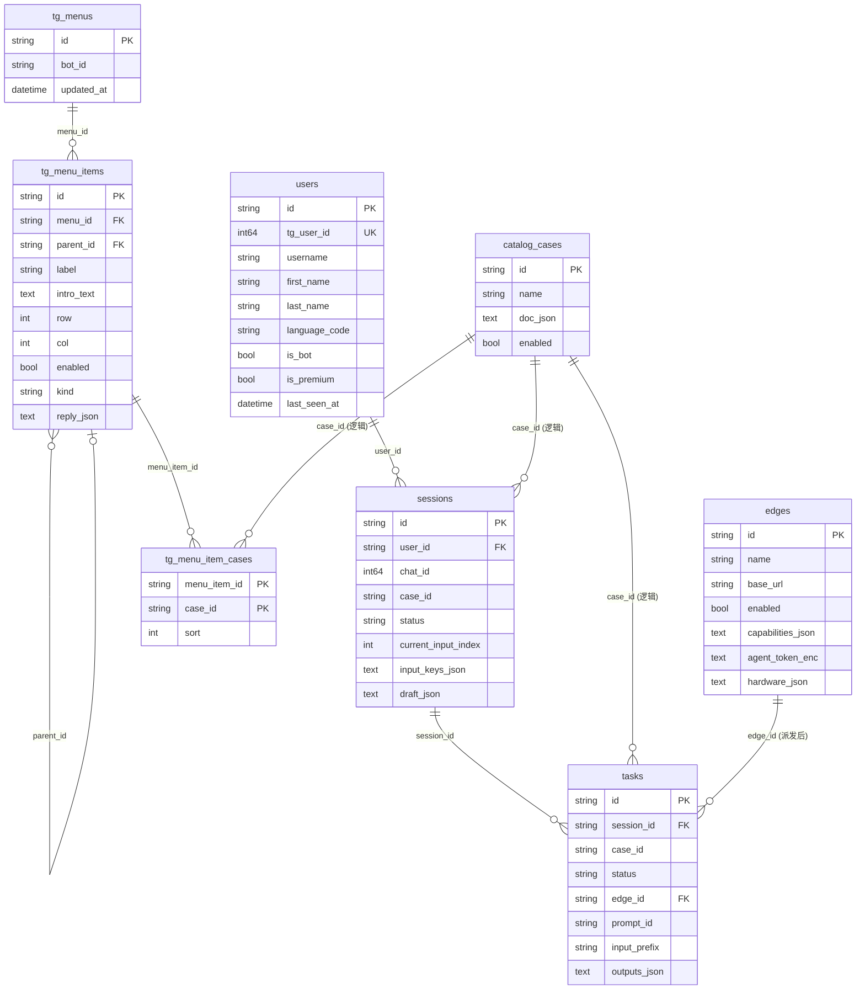
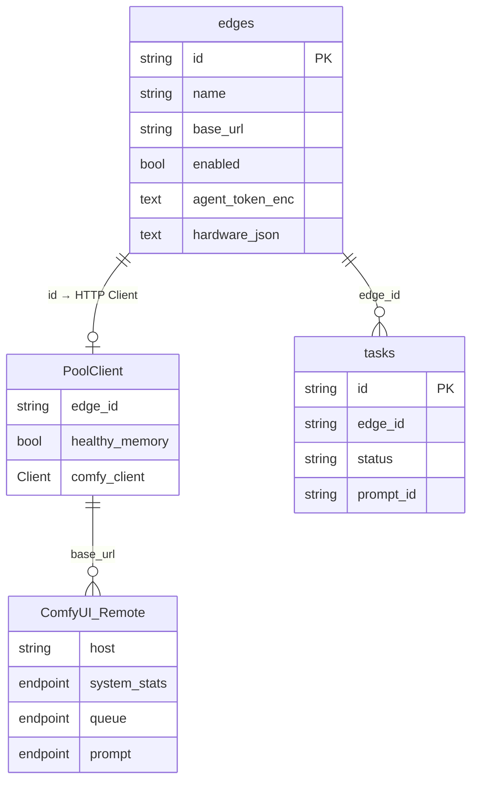
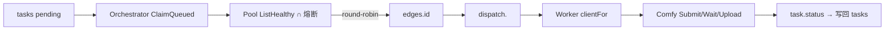

# 数据模型与 ER

> 系统总览见 [overview.md](./overview.md)；运行时链路见 [runtime.md](./runtime.md)。  
> 端到端样例（每阶段表行 / Blob / MQ）见 [task-data-walkthrough.md](./task-data-walkthrough.md)。  
> 数据库：默认 SQLite（`data/app.db`），Setup 向导可选 MySQL / Postgres（建议 MySQL 8.0+）；GORM AutoMigrate。业务库连接只在 Setup 向导配置，设置页只读展示驱动与 DSN；换库/跨引擎数据迁移为非目标（迁移走数据迁移 + 重跑 Setup）。  
> 引导态另存本机 `data/bootstrap.db`。业务 settings 在 `platform_settings`。

非库内状态（有意不落库）：

| 项 | 存放 | 说明 |
|---|---|---|
| 输入/输出文件 | `data/blob/` 或 OSS | Task 只存 `input_prefix` / outputs BlobRef |
| 同进程编排 | 进程内 memory | 跨进程派活走 Agent claim，不依赖 Redis |
| 熔断 / 健康缓存 / RR 游标 | 进程内存 | 可重建 |
| 通知去重 map | 进程内存 | 重启可能重复通知 |

---

## 1. 领域数据结构（内存/领域模型）

### 1.1 User（`internal/identity/domain`）

| 字段 | 类型 | 说明 |
|---|---|---|
| ID | string (UUID) | 内部主键 |
| TgUserID | int64 | Telegram `from.id`，唯一 |
| Username / FirstName / LastName | string | TG 资料 |
| LanguageCode | string | |
| IsBot / IsPremium | *bool | 可空 |
| LastSeenAt | time | upsert 刷新 |

### 1.2 Session（`internal/conversation/domain`）

| 字段 | 类型 | 说明 |
|---|---|---|
| ID | SessionID | |
| UserID | string | → users.id |
| ChatID | int64 | TG chat |
| CaseID | string | → catalog_cases.id（逻辑） |
| Status | collecting / confirming / submitted / exited | |
| CurrentInputIndex | int | |
| InputKeys | []string | 采集顺序 |
| Draft | map[key]DraftValue | 草稿（文本/数/图 Blob 等） |

生命周期：**不含** Task 执行；确认后 → `submitted`，行长期保留。

### 1.3 Task（`internal/runtime/domain`）

| 字段 | 类型 | 说明 |
|---|---|---|
| ID | TaskID | |
| SessionID | SessionID | **必填** → sessions.id |
| ChatID | ChatID | 可选缓存，**非**必需落库列 |
| CaseID | CaseID | 逻辑关联 Case |
| Status | pending→queued→running→终态 | 执行态唯一真相源 |
| EdgeID | EdgeID | 派发后写入 |
| PromptID | string | Comfy prompt id |
| JobRef | string | 可领取 job 包路径 |
| LeaseUntil | time | claim 租约截止 |
| DispatchTopic | string | 实际路由 Topic（空值按默认 Topic 处理） |
| Attempts | int | 失败/执行尝试计数（有界重试） |
| RequeueAt | time | 失败重试退避到期时间；到期前不可被领取 |
| InputPrefix | string | blob 路径前缀 |
| Outputs | []OutputRef | 产物 Blob |
| ErrorCode / ErrorMessage | string | |

### 1.4 Edge Record（`internal/platform/edge`）

管理界面叫「计算节点」。代码/表/接口叫 edge。

| 字段 | 类型 | 说明 |
|---|---|---|
| ID | EdgeID | 稳定字符串，系统生成（如 `local` / `node-…`） |
| Name | string | 展示名 |
| Description | string | 可选 |
| BaseURL | string | Comfy HTTP 根 |
| Enabled | bool | |
| Capabilities | []string | 可选分类 |
| AgentTokenEnc | string | 该节点 AGENT_TOKEN 密文 |
| Hardware | CPU / 内存 / 显卡列表 | 首次 presence 写入；手改或「从机器更新」可覆盖 |
| HardwareRefreshRequested | bool | 下一拍心跳带规格 |
| SubscribeTopics | []string | 订阅 Topic 列表；空 = 默认 Topic。Edge 首次 presence 声明写入，管理端 PATCH 可覆盖 |

### 1.5 Case Document（存在 `catalog_cases.doc_json`）

顶层：`id/name/description/.../inputs/outputs/bindings/input_schema`，可选 `routing`（`{rules: [{when: <条件 JSON>, topic: <key>}]}`，首个命中即投，无命中回退默认 Topic）。  
`bindings.workflow` = **整份 Comfy API workflow JSON**；`bindings.inputs/outputs` = 字段↔节点映射。

---

## 2. 数据库表结构

### 2.1 `users`

| 列 | 约束 | 说明 |
|---|---|---|
| id | PK | UUID |
| tg_user_id | UNIQUE NOT NULL | Telegram user id |
| username, first_name, last_name | | |
| language_code | | |
| is_bot, is_premium | nullable bool | |
| last_seen_at | NOT NULL | |
| created_at, updated_at | | |

### 2.2 `sessions`

| 列 | 约束 | 说明 |
|---|---|---|
| id | PK | |
| user_id | NOT NULL, index | → users.id（应用层关联） |
| chat_id | NOT NULL, index | |
| case_id | NOT NULL | → catalog_cases.id（逻辑） |
| status | NOT NULL | |
| current_input_index | NOT NULL | |
| input_keys_json | TEXT | |
| draft_json | TEXT | |
| created_at, updated_at | NOT NULL | |

### 2.3 `tasks`

| 列 | 约束 | 说明 |
|---|---|---|
| id | PK | |
| session_id | NOT NULL, index | → sessions.id |
| case_id | NOT NULL | |
| status | NOT NULL, index | |
| edge_id | index, 可空 | → edges.id（派发后） |
| prompt_id | 可空 | |
| job_ref_json | TEXT | 可领取 job 描述 |
| lease_until | 可空 | claim 租约 |
| input_prefix | NOT NULL | |
| outputs_json | TEXT | |
| error_code, error_message | | |
| created_at, updated_at | NOT NULL | |

### 2.4 `edges`

启动时若仍有旧表 `comfy_instances` 则改名为 `edges`。

| 列 | 约束 | 说明 |
|---|---|---|
| id | PK | 系统生成 |
| name | | 展示名 |
| description | TEXT | |
| base_url | NOT NULL | |
| enabled | NOT NULL | |
| capabilities_json | TEXT | |
| agent_token_enc | TEXT | 加密后的 AGENT_TOKEN |
| hardware_json | TEXT | CPU / 内存 / 显卡 |
| hardware_refresh_requested | NOT NULL | 下一拍心跳覆盖规格 |
| started_at | nullable | 节点 agent 首次心跳时间（进程内只记一次） |
| comfy_version | nullable | 节点 Comfy 版本（解析 `/system_stats` 的 comfyui_version） |
| created_at, updated_at | NOT NULL | |

### 2.4b `edge_metrics`

Edge 心跳上报的实时系统指标快照，整快照 JSON 一列，写入时清理超保留窗口（默认 24h，`METRICS_RETENTION` 可配）的旧行。

| 列 | 约束 | 说明 |
|---|---|---|
| id | PK 自增 | |
| edge_id | index | → edges.id |
| metrics_json | TEXT | CPU 占用率、内存占用/总量/占用率、GPU 占用率与显存占用/总量/占用率（nvidia-smi）、磁盘 I/O 读/写速率 |
| collected_at | index | 采集时间（UTC） |

### 2.4a `platform_settings`

业务库单行配置：部署位置（local/remote）、blob 驱动、密文 Token/密钥等。不含 `queue.driver`。

引导态 `bootstrap_meta`（本机 `bootstrap.db`）：initialized、管理员哈希、业务库 driver/DSN、enc key、向导进度。 |

### 2.4c 任务统计表（`task_daily_stats` / `task_edge_daily_stats` / `task_error_daily_stats`）

任务进入终态（succeeded / failed / cancelled）时由 orchestrator 写路径按 `completed_at` 归天（`STATS_TIMEZONE`，默认 Asia/Shanghai）幂等 upsert 四张窄表；读取走管理端 `/api/v1/stats/tasks/{daily,errors,edges}` 与 `/api/v1/stats/cases/top`，不扫描任务全表。保留期默认 365 天（`TASK_STATS_RETENTION` 可配），写入后清理过期行；`apps/pixoma/cmd/backfill-task-stats` 可从 `tasks` 表按天重算绝对值覆盖（可重复执行）。

`task_daily_stats`（按天全局计数）：

| 列 | 约束 | 说明 |
|---|---|---|
| stat_date | PK | YYYY-MM-DD（应用层按时区归天） |
| processed_count / succeeded_count / failed_count / cancelled_count | not null default 0 | processed = 成功 + 失败 + 取消 |
| total_duration_ms | not null default 0 | 终态耗时累计（completed_at - created_at） |
| total_queue_ms / total_exec_ms | not null default 0 | 排队耗时累计（created→started）与执行耗时累计（started→completed），负值按 0 |
| updated_at | not null | 最近更新（UTC） |

`task_edge_daily_stats`：PK `(stat_date, edge_id)`，`processed_count` 为每节点每日已处理任务数（仅终态任务按 edge_id 计数），`succeeded_count` / `failed_count` 供每节点成功率。

`task_error_daily_stats`：PK `(stat_date, error_code)`，`count` 为每日错误码出现次数（仅非空 error_code）。

`task_case_daily_stats`：PK `(stat_date, case_id)`，`count` 与 `total_duration_ms` 为按 Case 聚合的终态任务数与耗时累计（Case 热度与耗时散点数据源）。

### 2.5 `catalog_cases`（既有）

| 列 | 约束 | 说明 |
|---|---|---|
| id | PK | Case id |
| name | NOT NULL | |
| tags_json / cats_json | | 冗余索引用 |
| doc_json | NOT NULL | 完整 CaseDocument（含 workflow） |
| enabled | index | |
| created_at, updated_at | | |

### 2.5b `topics`（新增）

| 列 | 约束 | 说明 |
|---|---|---|
| key | PK | 稳定 Topic 标识（`^[a-z0-9]([a-z0-9-]{0,62}[a-z0-9])?$`）；`default` 保留且不可删除 |
| name | NOT NULL | 显示名 |
| enabled | NOT NULL | 禁用后不可作新路由目标/新订阅 |
| created_at, updated_at | | |

启动时幂等种入 `default`；调度只向 `dispatch_topic` 对应的 Topic 投放，节点按订阅集合原子领取。

### 2.6 TG 主键盘树（`tg_menus` / `tg_menu_items` / `tg_menu_item_cases`）

Telegram 主 ReplyKeyboard 配置真相源，**关系型树**（非 JSON 文档）。当前单 Bot、单菜单：`tg_menus.id` 固定为 `default`，`bot_id` 固定为 `default`。

#### `tg_menus`

| 列 | 约束 | 说明 |
|---|---|---|
| id | PK | 菜单文档 id（当前仅 `default`） |
| bot_id | NOT NULL | Bot 标识（当前仅 `default`） |
| updated_at | NOT NULL | UTC |

#### `tg_menu_items`

扁平存储树节点；`parent_id` 为空表示根级（ReplyKeyboard 行）。

| 列 | 约束 | 说明 |
|---|---|---|
| id | PK | 节点 id（如 `btn-image`） |
| menu_id | NOT NULL, index | → `tg_menus.id` |
| parent_id | index, 可空 | → 父节点 `tg_menu_items.id` |
| label | NOT NULL | 按钮文案 |
| row, col | NOT NULL | 根级 ReplyKeyboard 布局（子节点可忽略） |
| enabled | NOT NULL | |
| kind | NOT NULL | `folder` / `open_case` / `list_cases_by_tag` / `placeholder` / `reply_media` |
| placeholder_text | | `placeholder` 提示 |
| intro_text | TEXT | 仅 `folder`：进层消息正文（空则用 `label`） |
| tag | | `list_cases_by_tag` 分区 tag |
| reply_json | TEXT | `reply_media` 的 `{text, images[]}` |

`folder` 子树通过 `parent_id` 表达；`open_case` / `folder` 挂载的 Case 见关联表。

#### `tg_menu_item_cases`

节点 ↔ Case 多对多（有序）；主要用于 `folder` 内 Case 列表与 `open_case` 单 Case。

| 列 | 约束 | 说明 |
|---|---|---|
| menu_item_id | PK (复合) | → `tg_menu_items.id` |
| case_id | PK (复合) | → `catalog_cases.id`（逻辑） |
| sort | NOT NULL | 同节点内排序 |

#### 种子与迁移

- **空库**：`EnsureDefault` 写入 `DefaultSeedTree`（六键根菜单；「🖼 图片」为 `folder`，并挂上 tag=`image` 的 Case id 列表）。
- **旧库**：若关系表为空且存在遗留表 `tg_menu_configs`（`items_json`），一次性导入为扁平根节点后弃用 JSON 表。
- **写入**：`ReplaceTree` 事务整树替换（删旧 items + cases 再插入）。

> SQLite **未声明物理外键**；关联由应用层保证（GORM 默认不强制 FK）。

---

## 3. 表关系 ER 图

读法：

- **强业务链**：`users` ← `sessions` ← `tasks`
- **Case**：Session/Task 用字符串 `case_id` 指向目录
- **计算节点**：仅在 Task `queued+` 后写入 `edge_id`
- **TG 主菜单**：`tg_menus` + `tg_menu_items` 存树；`tg_menu_item_cases` 挂 Case；folder 子级用 `parent_id`

---

## 4. 计算节点关系 ER / 运行关系图

「计算节点」既指 DB 中的 `edges`，也指进程内 Pool 客户端。

调度关系（非表，运行时）：

观测 API（只读）：

| 路径 | 数据源 |
|---|---|
| `GET /api/v1/edges` | `edges` |
| `GET /api/v1/edges/presence` | 控制面内存 last_seen / comfy_running（不落库） |
| `GET .../{id}/system` | 该节点 Comfy `/system_stats` |
| `GET .../{id}/queue` | 该节点 Comfy `/queue` |
| `GET .../{id}/tasks` | `tasks WHERE edge_id=?` |
| `GET .../{id}/stats` | 该节点任务数 / 累计耗时 / 成功率 |

---

## 5. 状态机（简）

**Session：** `collecting` → `confirming` → `submitted` | `exited`

**Task：** `pending` → `queued`（写 edge_id）→ `running`（写 prompt_id）→ `succeeded` | `failed` | `cancelled`

完整调度/事件语义见 [runtime.md](./runtime.md)。

---

## 6. 相关代码入口

| 表 / 能力 | 包路径 |
|---|---|
| users | `internal/identity/infrastructure/persistence` |
| sessions | `internal/conversation/infrastructure/persistence` |
| tasks | `internal/runtime/infrastructure/persistence` |
| edges / Pool | `internal/platform/edge` |
| catalog_cases | `internal/catalog/infrastructure/persistence` |
| channel_main_menus | `internal/menucard`（嵌套树 JSON）；HTTP `GET/PUT /api/v1/channels/{id}/menu`；Case 反查 `GET .../cases/{id}/menu-placements`。卡片内嵌在树节点，无独立 cards 管理 API。 |
| HTTP API | `internal/httpapi/edges` 等 |
| 任务统计 | `internal/platform/taskstats`（领域/仓储）、`internal/httpapi/stats`（HTTP）、backfill `apps/pixoma/cmd/backfill-task-stats` |
| 接线 | `apps/pixoma/cmd/pixoma/main.go`（组合根） |

设计原文：`docs/superpowers/specs/2026-08-08-comfy-multi-instance-design.md`
