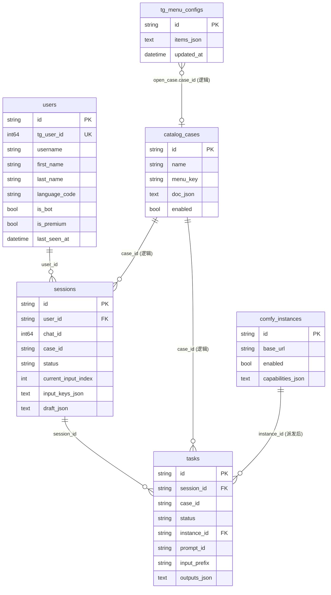
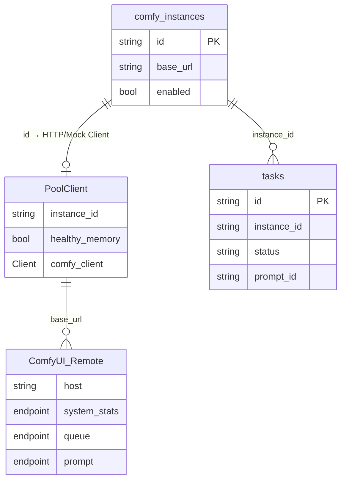
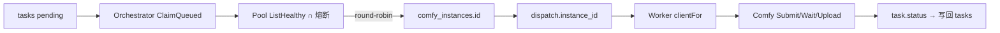

# 数据模型与 ER

> 系统总览见 [overview.md](./overview.md)；运行时链路见 [runtime.md](./runtime.md)。  
> 数据库：SQLite（默认 `data/app.db`），GORM AutoMigrate。  
> 对应能力：User / Session / Task 落库 + 多 Comfy 实例池。

非库内状态（有意不落库）：

| 项 | 存放 | 说明 |
|---|---|---|
| 输入/输出文件 | `data/blob/` | Task 只存 `input_prefix` / outputs BlobRef |
| 事件总线 | 进程内 memory | `task.created` / `dispatch.*` / `task.status` |
| 熔断 / 健康缓存 / RR 游标 | 进程内存 | 可重建 |
| 通知去重 map | 进程内存 | 重启可能重复通知 |

---

## 1. 领域数据结构（内存/领域模型）

### 1.1 User（`internal/identity/domain`）

| 字段 | 类型 | 说明 |
|---|---|---|
| ID | string (UUID) | 内部主键 |
| TgUserID | int64 | Telegram `from.id`，唯一 |
| Username / FirstName / LastName | string | TG 资料 |
| LanguageCode | string | |
| IsBot / IsPremium | *bool | 可空 |
| LastSeenAt | time | upsert 刷新 |

### 1.2 Session（`internal/conversation/domain`）

| 字段 | 类型 | 说明 |
|---|---|---|
| ID | SessionID | |
| UserID | string | → users.id |
| ChatID | int64 | TG chat |
| CaseID | string | → catalog_cases.id（逻辑） |
| Status | collecting / confirming / submitted / exited | |
| CurrentInputIndex | int | |
| InputKeys | []string | 采集顺序 |
| Draft | map[key]DraftValue | 草稿（文本/数/图 Blob 等） |

生命周期：**不含** Task 执行；确认后 → `submitted`，行长期保留。

### 1.3 Task（`internal/runtime/domain`）

| 字段 | 类型 | 说明 |
|---|---|---|
| ID | TaskID | |
| SessionID | SessionID | **必填** → sessions.id |
| ChatID | ChatID | 可选缓存，**非**必需落库列 |
| CaseID | CaseID | 逻辑关联 Case |
| Status | pending→queued→running→终态 | 执行态唯一真相源 |
| InstanceID | InstanceID | 派发后写入 |
| PromptID | string | Comfy prompt id |
| InputPrefix | string | blob 路径前缀 |
| Outputs | []OutputRef | 产物 Blob |
| ErrorCode / ErrorMessage | string | |

### 1.4 Comfy Instance Record（`internal/platform/instance`）

| 字段 | 类型 | 说明 |
|---|---|---|
| ID | InstanceID | 稳定字符串，如 `local` / `gpu-1` |
| BaseURL | string | Comfy HTTP 根 |
| Enabled | bool | |
| Capabilities | []string | 可选标签 |

### 1.5 Case Document（存在 `catalog_cases.doc_json`）

顶层：`id/name/description/.../inputs/outputs/bindings/input_schema`。  
`bindings.workflow` = **整份 Comfy API workflow JSON**；`bindings.inputs/outputs` = 字段↔节点映射。

---

## 2. 数据库表结构

### 2.1 `users`

| 列 | 约束 | 说明 |
|---|---|---|
| id | PK | UUID |
| tg_user_id | UNIQUE NOT NULL | Telegram user id |
| username, first_name, last_name | | |
| language_code | | |
| is_bot, is_premium | nullable bool | |
| last_seen_at | NOT NULL | |
| created_at, updated_at | | |

### 2.2 `sessions`

| 列 | 约束 | 说明 |
|---|---|---|
| id | PK | |
| user_id | NOT NULL, index | → users.id（应用层关联） |
| chat_id | NOT NULL, index | |
| case_id | NOT NULL | → catalog_cases.id（逻辑） |
| status | NOT NULL | |
| current_input_index | NOT NULL | |
| input_keys_json | TEXT | |
| draft_json | TEXT | |
| created_at, updated_at | NOT NULL | |

### 2.3 `tasks`

| 列 | 约束 | 说明 |
|---|---|---|
| id | PK | |
| session_id | NOT NULL, index | → sessions.id |
| case_id | NOT NULL | |
| status | NOT NULL, index | |
| instance_id | index, 可空 | → comfy_instances.id（派发后） |
| prompt_id | 可空 | |
| input_prefix | NOT NULL | |
| outputs_json | TEXT | |
| error_code, error_message | | |
| created_at, updated_at | NOT NULL | |

### 2.4 `comfy_instances`

| 列 | 约束 | 说明 |
|---|---|---|
| id | PK | |
| base_url | NOT NULL | |
| enabled | NOT NULL | |
| capabilities_json | TEXT | |
| created_at, updated_at | NOT NULL | |

### 2.5 `catalog_cases`（既有）

| 列 | 约束 | 说明 |
|---|---|---|
| id | PK | Case id |
| name | NOT NULL | |
| menu_key | index | |
| tags_json / cats_json | | 冗余索引用 |
| doc_json | NOT NULL | 完整 CaseDocument（含 workflow） |
| enabled | index | |
| created_at, updated_at | | |

### 2.6 `tg_menu_configs`

Telegram 主 ReplyKeyboard 配置真相源（单文档，`id` 固定为 `default`）。

| 列 | 约束 | 说明 |
|---|---|---|
| id | PK | 文档 id（当前仅 `default`） |
| items_json | NOT NULL | `MenuItem[]` JSON（label/row/col/action/`reply` 等） |
| updated_at | NOT NULL | UTC |

空表首次读时由应用层 upsert 默认种子（对齐现网六键主菜单）。`open_case` 的 `case_id` 逻辑指向 `catalog_cases.id`（无物理 FK）。

> SQLite **未声明物理外键**；关联由应用层保证（GORM 默认不强制 FK）。

---

## 3. 表关系 ER 图

读法：

- **强业务链**：`users` ← `sessions` ← `tasks`
- **Case**：Session/Task 用字符串 `case_id` 指向目录
- **实例**：仅在 Task `queued+` 后写入 `instance_id`
- **TG 主菜单**：`tg_menu_configs` 存整份键盘；`open_case` 逻辑引用 Case

---

## 4. 实例关系 ER / 运行关系图

「实例」既指 DB 中的 `comfy_instances`，也指进程内 Pool 客户端。

调度关系（非表，运行时）：

观测 API（只读）：

| 路径 | 数据源 |
|---|---|
| `GET /api/v1/comfy-instances` | `comfy_instances` |
| `GET .../{id}/system` | 该实例 Comfy `/system_stats` |
| `GET .../{id}/queue` | 该实例 Comfy `/queue` |
| `GET .../{id}/tasks` | `tasks WHERE instance_id=?` |

---

## 5. 状态机（简）

**Session：** `collecting` → `confirming` → `submitted` | `exited`

**Task：** `pending` → `queued`（写 instance_id）→ `running`（写 prompt_id）→ `succeeded` | `failed` | `cancelled`

完整调度/事件语义见 [runtime.md](./runtime.md)。

---

## 6. 相关代码入口

| 表 / 能力 | 包路径 |
|---|---|
| users | `internal/identity/infrastructure/persistence` |
| sessions | `internal/conversation/infrastructure/persistence` |
| tasks | `internal/runtime/infrastructure/persistence` |
| comfy_instances / Pool | `internal/platform/instance` |
| catalog_cases | `internal/catalog/infrastructure/persistence` |
| tg_menu_configs | `internal/tgmenu`（domain/application/persistence）；HTTP `internal/httpapi/tgmenu` |
| HTTP API | `internal/httpapi/comfyinstances` 等 |
| 接线 | `apps/bot/cmd/comfyui-bot/main.go`、`apps/admin-api/cmd/admin-api/main.go` |

设计原文：`docs/superpowers/specs/2026-08-08-comfy-multi-instance-design.md`
