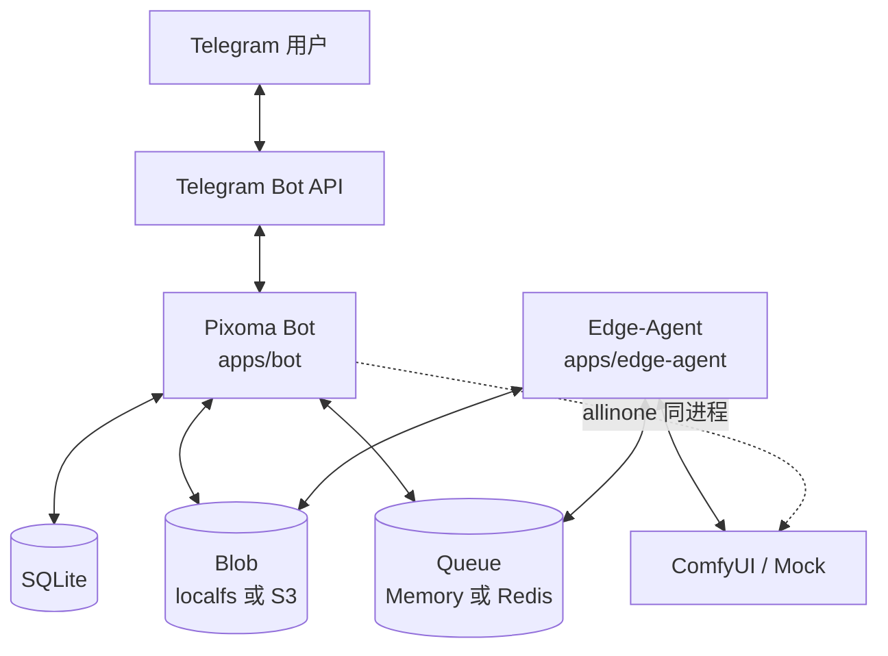

# Pixoma 系统架构总览

> Go monorepo：Telegram Bot + Case Catalog + 对话 Session + Task 运行时 + 多 ComfyUI 实例池。  
> 部署形态：**双模式** — `allinone`（默认，单进程 Memory+localfs）与 `split`（云 Bot + `apps/edge-agent`，Redis Streams + S3）。

数据表 / ER 见 [data-model.md](./data-model.md)。限界上下文细节见 [bounded-contexts.md](./bounded-contexts.md)。执行链路见 [runtime.md](./runtime.md)。

---

## 1. 系统上下文



| 外部系统 | 关系 |
|---|---|
| Telegram | 入站 Update（菜单/填表/确认）；出站文案与图片 |
| ComfyUI | 执行面 Submit / Wait / Upload；可由 Mock 替换（`comfy_mock`） |
| Redis Streams / S3 | **仅 split**：任务队列与 job/产物对象存储 |
| 运维 HTTP | admin-api 管理实例与观测（**当前无鉴权**） |

**方案 A：** ConfirmRun 后云侧 `PrepareJob` 写 `jobs/<task_id>/job.json`，dispatch 带 `job_ref`；执行面（同进程或 Edge）只认 job，不读 Case/Task DB 拼装。

---

## 2. 进程内逻辑视图

```text
┌──────────────────────── apps/bot (组合根) ────────────────────────┐
│  botconfig · db.AutoMigrate · Case/Instance seed · HTTP · ticker   │
│                                                                    │
│  ┌─ channel/tg ─────────────────────────────────────────────────┐ │
│  │  Adapter · Messenger · notifybridge                          │ │
│  └───────────────────────────┬──────────────────────────────────┘ │
│                              ▼                                    │
│  ┌─ packaging/botapp (应用门面) ────────────────────────────────┐ │
│  │  StartCase / ConfirmRun / …                                  │ │
│  └─┬──────────────┬──────────────┬──────────────┬───────────────┘ │
│    ▼              ▼              ▼              ▼                 │
│ identity     conversation     catalog        runtime              │
│  users        sessions       cases      Task + Orchestrator       │
│                                          + Actuator               │
│                              │                                    │
│  ┌─ platform ────────────────▼────────────────────────────────┐  │
│  │  queue/memory · blob/localfs · notify · instance.Pool · db │  │
│  └────────────────────────────────────────────────────────────┘  │
│  ┌─ httpapi/comfyinstances ───────────────────────────────────┐  │
│  │  CRUD + /system + /queue + /tasks                          │  │
│  └────────────────────────────────────────────────────────────┘  │
└────────────────────────────────────────────────────────────────────┘
         │ dispatch.<id>          │ HTTP
         ▼                        ▼
    ComfyUI / Mock           运维观测
```

可视化拓扑（HTML）：[diagrams/system.html](./diagrams/system.html)。

---

## 3. 仓库布局

| 路径 | 角色 |
|---|---|
| `apps/bot/cmd/comfyui-bot` | Bot 进程入口（组装与生命周期；对话 / 编排；allinone 含执行面） |
| `apps/edge-agent` | split 执行面：订 Redis dispatch、读 S3 job、本机 Comfy |
| `apps/admin-api` | 管理 HTTP（实例 + Case/User/Session/Task；约定不依赖 `channel/tg`） |
| `web/admin` | 管理 SPA：经 `VITE_ADMIN_API_BASE` 仅访问 admin-api（无前端 mock） |
| `internal/catalog` | Case 目录与协议校验 |
| `internal/conversation` | 填表 Session（不含 Task 执行） |
| `internal/identity` | User（TG From upsert） |
| `internal/runtime` | Task 领域 + Orchestrator + Actuator + Comfy 客户端 |
| `internal/channel/tg` | Telegram 适配与通知落地 |
| `internal/packaging/botapp` | 跨 BC 用例编排 |
| `internal/platform/*` | db / blob / queue / notify / instance / botconfig |
| `internal/httpapi` | 嵌入式 HTTP API |
| `internal/sharedkernel` | ID、状态、事件 DTO、topic 常量 |
| `configs/` | `bot.yaml`、Case 种子、实例种子 |
| `docs/architecture/` | 本架构文档集 |

---

## 4. 核心能力切片

| 能力 | 实现要点 |
|---|---|
| 对话填表 | TG → Session 状态机 → `submitted` 后行长期保留 |
| 确认生成 | `ConfirmRun` 写 Task、落 blob 输入、发 `task.created` |
| 调度 | Orchestrator：`ClaimQueued` + 健康实例 round-robin + 熔断 |
| 执行 | Actuator：按 `instance_id` 取客户端，Submit/Wait，产物入 blob |
| 通知 | 终态 → `notify.Publisher` → TG 发图/文案（不走 queue topic） |
| 多实例 | `comfy_instances` + Pool；健康探测；动态 `dispatch.<id>` 订阅 |
| Mock | `comfy_mock` / `COMFY_MOCK` → `comfyui.NewClient`；主路径可无真实 Comfy |

---

## 5. 配置与数据落盘

| 配置键 | 作用 |
|---|---|
| `telegram_bot_token` / `TG_BOT_TOKEN` | Bot Token |
| `comfy_mock` / `COMFY_MOCK` | Mock ↔ 真实 HTTP |
| `comfyui_base_url` + `default_instance_id` | 单实例种子 |
| `comfy_instances[]` | 多实例种子（优先） |
| `health_probe_interval` | 健康探测周期 |
| `case_seed_dir` | Case JSON 种子目录 |
| `blob_root` / `DATA_DIR` | Blob 与默认 `app.db` 位置 |
| `http_addr` | 嵌入 HTTP 监听 |

默认本地数据：`data/app.db`、`data/blob/`。

---

## 6. 依赖方向（摘要）

```text
apps/bot  ──组装──►  全部模块
channel/tg  → packaging/botapp → domain BCs + platform ports
runtime/{orchestrator,actuator} → runtime/domain + platform + catalog(执行用)
domain/* → sharedkernel only（BC domain 互不引用）
platform/* → sharedkernel（Pool 例外：持有 comfyui.Client）
```

细则与包表：[bounded-contexts.md](./bounded-contexts.md)。

---

## 7. 有意不持久化的状态

| 项 | 存放 | 影响 |
|---|---|---|
| 事件总线 | 进程内 memory（同步 fan-out） | 重启丢在途事件；靠 Task 对账 |
| 健康 / 熔断 / RR 游标 | 内存 | 可重建 |
| 通知去重 | 内存 | 重启可能重复通知 |
| Blob 文件 | 文件系统 | Task 只存路径前缀与 Outputs JSON |

---

## 8. 相关规格

- OpenSpec 主规格：`docs/openspec/specs/`
- 设计原文：`docs/superpowers/specs/2026-08-08-comfy-multi-instance-design.md`
- 运维命令：仓库根 [README.md](../../README.md)
