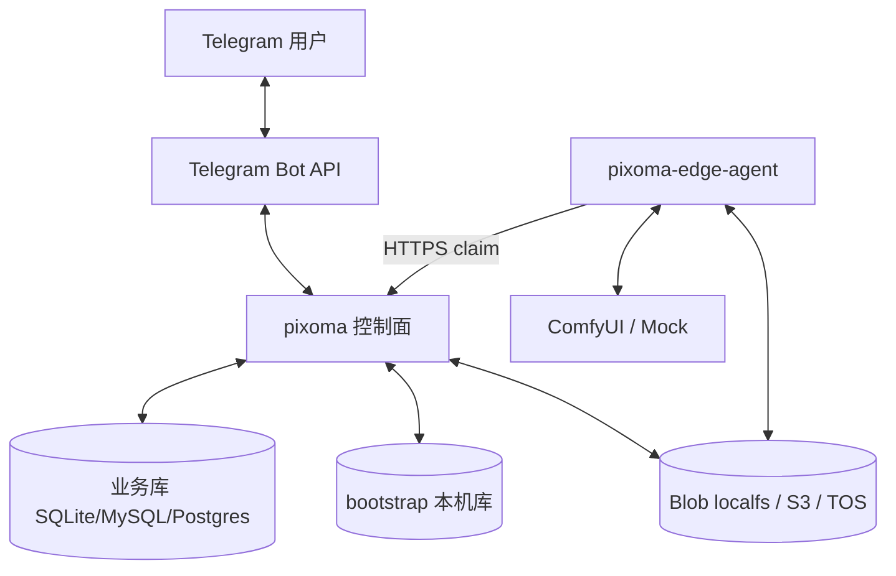

# Pixoma 系统架构总览

> Go monorepo：Telegram Bot + Case Catalog + 对话 Session + Task 运行时 + 多 ComfyUI 实例池。  
> 部署形态：**本机 / 远程** — 控制面 `pixoma` + 执行面 `pixoma-edge-agent`。默认无 Redis、无用户侧 `queue.driver` / `runtime_mode`。

数据表 / ER 见 [data-model.md](./data-model.md)。限界上下文细节见 [bounded-contexts.md](./bounded-contexts.md)。执行链路见 [runtime.md](./runtime.md)。

---

## 1. 系统上下文



| 外部系统 | 关系 |
|---|---|
| Telegram | 入站 Update；出站文案与图片 |
| ComfyUI | Edge Submit / Wait / Upload；可由 Mock 替换（`comfy_mock`） |
| 对象存储 | **远程**：S3 或 TOS；**本机**：localfs 共用目录。远程禁止 localfs |
| 运维 HTTP | `pixoma` 托管管理 API +（发布）静态后台；需管理员会话 |

ConfirmRun 后控制面 `PrepareJob` 写 `jobs/<task_id>/job.json`，任务进入可领取态；Edge 只认 job，不读 Case/Task DB 拼装。

---

## 2. 进程视图

```text
┌─ pixoma（控制面）──────────────────────────────────────────────┐
│  bootstrap · settings · TG · Orchestrator · 管理 API · Agent API │
│  本机：spawn pixoma-edge-agent                                    │
└───────────────┬───────────────────────────────┬──────────────────┘
                │ claim/heartbeat/status         │ blob
        ┌───────▼────────┐              ┌───────▼────────┐
        │ 业务 DB        │              │ Blob           │
        │ Task 可领取态  │              │ localfs|S3|TOS │
        └────────────────┘              └───────┬────────┘
                                                │
                                ┌───────────────▼───────────────┐
                                │ pixoma-edge-agent（唯一执行面） │
                                └───────────────┬───────────────┘
                                                ▼
                                         ComfyUI / Mock
```

可视化拓扑（HTML）：[diagrams/system.html](./diagrams/system.html)。

---

## 3. 仓库布局

| 路径 | 角色 |
|---|---|
| `apps/pixoma/cmd/pixoma` | 控制面一体入口（引导、向导、管理 API、Agent API、本机 spawn Edge） |
| `apps/edge-agent` | 执行面：长轮询 claim、读 blob job、本机 Comfy |
| `web/admin` | 管理 SPA：登录 / 向导 / 业务壳；发布 `go:embed` 进 pixoma |
| `internal/catalog` | Case 目录与协议校验 |
| `internal/conversation` | 填表 Session（不含 Task 执行） |
| `internal/identity` | User（TG From upsert） |
| `internal/runtime` | Task 领域 + Orchestrator + Actuator + Comfy 客户端 |
| `internal/channel/tg` | Telegram 适配与通知落地 |
| `internal/packaging/botapp` | 跨 BC 用例编排 |
| `internal/platform/*` | db / blob / bootstrap / settings / notify / instance / botconfig |
| `internal/httpapi` | 管理 API、Agent API、向导 |
| `internal/sharedkernel` | ID、状态、事件 DTO |
| `configs/` | Case 种子等 |
| `docs/architecture/` | 本架构文档集 |

---

## 4. 核心能力切片

| 能力 | 实现要点 |
|---|---|
| 对话填表 | TG → Session 状态机 → `submitted` 后行长期保留 |
| 确认生成 | `ConfirmRun` 写 Task、落 blob 输入；同进程编排可走内存通道 |
| 调度 | Orchestrator：prep `job_ref` 后进入可领取态（queued + lease） |
| 执行 | Edge 长轮询 claim → Worker：Submit/Wait，产物入 blob |
| 通知 | 终态 → `notify.Publisher` → TG 发图/文案 |
| 多计算节点 | `edges` + Pool；健康探测 |
| Mock | `comfy_mock` / `COMFY_MOCK` → `comfyui.NewClient`；主路径可无真实 Comfy |

---

## 5. 配置与数据落盘

| 配置键 | 作用 |
|---|---|
| 向导 settings / `TG_BOT_TOKEN` | Bot Token（落库加密；env 可紧急覆盖） |
| `comfy_mock` / `COMFY_MOCK` | Mock ↔ 真实 HTTP |
| `comfyui_base_url` + `default_edge_id` | 单节点种子 |
| `placement` | local / remote（校验 blob；远程禁 localfs） |
| `DATA_DIR` | bootstrap、默认 SQLite、blob |
| `http_addr` / `HTTP_ADDR` | 控制面监听 |

默认本地数据：`data/bootstrap.db`、`data/app.db`、`data/blob/`。

---

## 6. 依赖方向（摘要）

```text
apps/pixoma  ──组装──►  控制面模块 + 管理/Agent HTTP
channel/tg  → packaging/botapp → domain BCs + platform ports
runtime/{orchestrator,actuator} → runtime/domain + platform + catalog(执行用)
domain/* → sharedkernel only（BC domain 互不引用）
platform/* → sharedkernel（Pool 例外：持有 comfyui.Client）
```

细则与包表：[bounded-contexts.md](./bounded-contexts.md)。

---

## 7. 有意不持久化的状态

| 项 | 存放 | 影响 |
|---|---|---|
| 同进程编排信号 | 进程内 memory（可选） | 跨进程不依赖；派活走 DB claim |
| 健康 / 熔断 / RR 游标 | 内存 | 可重建 |
| 通知去重 | 内存 | 重启可能重复通知 |
| Blob 文件 | 文件系统或 OSS | Task 只存路径前缀与 Outputs JSON |

---

## 8. 相关规格

- OpenSpec 主规格：`docs/openspec/specs/`
- 设计原文：`docs/superpowers/specs/2026-08-08-comfy-multi-instance-design.md`
- 运维命令：仓库根 [README.md](../../README.md)
