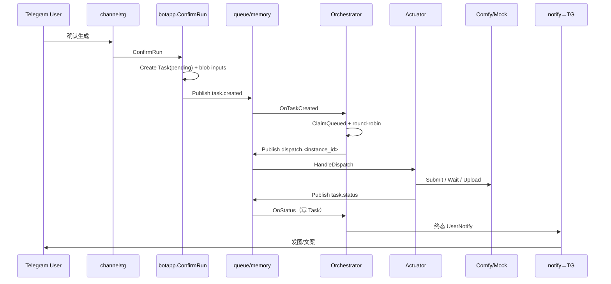

# 运行时：调度、执行与事件

> ConfirmRun 之后的控制面 / 执行面。数据落库见 [data-model.md](./data-model.md)。

---

## 1. 主链路（端到端）



说明：`memory` bus **同步**调用 handler；ConfirmRun 返回前，整条链路（含 notify）可能已完成。

对话入口：Telegram 主菜单来自表 `tg_menu_configs`（空则写入默认种子）；`channel/tg` 每次构建键盘时读配置（失败回退内存种子）。

---

## 2. 控制面 vs 执行面

| 角色 | 包 | 职责 |
|---|---|---|
| **Orchestrator** | `runtime/application/orchestrator` | 认领 pending、选健康实例、发 dispatch、收敛 status、终态 notify、对账 |
| **Actuator** | `runtime/infrastructure/actuator` | 按实例客户端跑 workflow、产物入 blob、上报 status |
| **Instance Pool** | `platform/instance` | CRUD 元数据、健康探测、持有 per-instance Client、RR 候选 |

Task 表是**执行态唯一真相源**（无独立 Actuator Ledger）。

---

## 3. 事件与端口

### Queue topics（`sharedkernel`）

| Topic | 载荷 | 方向 |
|---|---|---|
| `task.created` | `TaskCreated` | ConfirmRun → Orchestrator |
| `dispatch.<instance_id>` | `DispatchCommand` | Orchestrator → Actuator |
| `task.status` | `TaskStatusEvent` | Actuator → Orchestrator |

`TopicNotifyUser` 常量存在，**未走 queue**。

### Notify 端口

```text
Orchestrator ──Publish(UserNotify)──► platform/notify.Publisher
                                          │
                                          ▼
                                   tg/notifybridge
                                          │
                                          ▼
                                   Adapter.HandleUserNotify
```

### 关键代码

| 步骤 | 路径 |
|---|---|
| Confirm | `internal/packaging/botapp/confirm_run.go` |
| 事件 DTO | `internal/sharedkernel/events.go` |
| Orchestrator | `internal/runtime/application/orchestrator/service.go` |
| Actuator | `internal/runtime/infrastructure/actuator/worker.go` |
| Case→workflow | `internal/runtime/infrastructure/actuator/snapshot.go` |
| 组合根订阅 | `apps/bot/cmd/comfyui-bot/main.go` |

---

## 4. 调度策略

```text
pending Task
    → ListHealthy(enabled ∩ 探测成功 ∩ 未熔断)
    → ClaimQueued(CAS pending→queued, 写 instance_id)
    → Publish dispatch.<instance_id>
```

- **无可用实例**：不投递（Task 保持可重试态，由对账/后续 tick 再试）。
- **Round-robin**：在健康集合上轮转。
- **动态订阅**：实例启用变化时 `SubscriptionSet` 保证 `dispatch.<id>` 有 handler。
- **健康探测**：周期调该实例 `SystemStats`；间隔由 `health_probe_interval` 配置。

---

## 5. Comfy 客户端选型

```text
cfg.ComfyMock ──► Pool.Refresh ──► comfyui.NewClient(Options{Mock, BaseURL})
                                      ├─ true  → Mock（进程内，返回示例 PNG）
                                      └─ false → HTTP(BaseURL)
```

- 产品链路变更须保持 **Mock 端到端可通**（项目规则 `comfy-mock-parity`）。
- 观测 API：`GET .../system` → `/system_stats`；`GET .../queue` → `/queue`；业务历史**不用** Comfy `/history`，用 DB `tasks`。

---

## 6. Task 状态机

```text
pending → queued → running → succeeded
                           ↘ failed
                           ↘ cancelled
```

| 迁移时机 | 谁写 |
|---|---|
| Create `pending` | ConfirmRun |
| `queued` + `instance_id` | Orchestrator `ClaimQueued` |
| `running` + `prompt_id` | Actuator / status 回写 |
| 终态 + outputs/error | Orchestrator `OnStatus` |

Session 状态机（独立）：`collecting` → `confirming` → `submitted` | `exited`。Session **不含** Task 执行字段。

---

## 7. 观测与运维面

| HTTP | 数据源 |
|---|---|
| `GET/POST/PATCH/DELETE /api/v1/comfy-instances` | `comfy_instances` |
| `GET .../{id}/system` | 该实例 Comfy system_stats |
| `GET .../{id}/queue` | 该实例 Comfy queue |
| `GET .../{id}/tasks` | `tasks WHERE instance_id=?` |
| `GET /healthz` | 进程存活 |

> 实例 API **当前无鉴权**，仅本机/可信内网。
