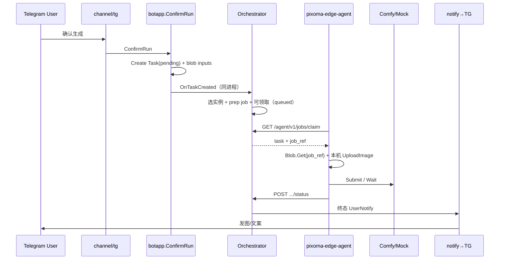

# 运行时：调度、执行与事件

> ConfirmRun 之后的控制面 / 执行面。数据落库见 [data-model.md](./data-model.md)；按阶段的样例数据快照见 [task-data-walkthrough.md](./task-data-walkthrough.md)。

---

## 1. 主链路（端到端）



默认跨进程派发是 **DB 可领取态 + Edge 长轮询**，不是 Redis Topic。

### 1.0 本机与远程

| 位置 | 进程 | Blob | 执行面 |
|---|---|---|---|
| 本机（默认） | `pixoma` 自动 spawn Edge | localfs 共用目录 | `pixoma-edge-agent` |
| 远程 | 控制面 + 独立 Edge | s3 或 tos（禁止 localfs） | Edge 出站 claim |

对话入口：Telegram 主 ReplyKeyboard 来自 `tg_menus` + `tg_menu_items`（空库种子或自 `tg_menu_configs` 迁移）；`channel/tg` 每次构建键盘时读 `MenuTree`（失败回退 `DefaultSeedTree`）。

### 1.1 TG 主键盘与 folder Inline 浏览

```mermaid
sequenceDiagram
  participant U as User
  participant TG as channel/tg
  participant M as tgmenu.Repository

  U->>TG: /start 或点根按钮
  TG->>M: GetTree(default)
  M-->>TG: MenuTree
  alt 根级 ReplyKeyboard
    TG->>U: SendMenu（按 row/col 布局）
  else kind=folder
    TG->>U: SendInline（正文 intro_text 或 label；Case 在前，子 folder，再返回）
    U->>TG: callback mf:&lt;item_id&gt; / mb:root|&lt;parent_id&gt;
    TG->>TG: showMenuFolder 下钻/返回
  else open_case / list_cases_by_tag / placeholder / reply_media
    TG->>TG: 既有 Case 列表或单 Case 预览链路
  end
```

要点：

- **根键盘**：仅 `parent_id` 为空的启用节点；`BuildReplyKeyboard` 按 `(row, col)` 排序。
- **folder**：根按钮或 Inline「📁」进入 `showMenuFolder`；消息正文优先 `intro_text`（空则用 `label`）；按钮顺序为同节点 `case_ids`（`CBCasePreview`）→ 子 folder（`mf:`）→ 「⬅️ 返回」（`mb:root` / `mb:<parent_id>`）。
- **list_cases_by_tag**：仍走既有按 tag 列表 Inline（兼容旧 `btn-image` 行为）；与 folder 内挂 Case 可并存。
- **callback 编码**：`mf:<menu_item_id>` 下钻；`mb:root` / `mb:<parent_item_id>` 返回（见 `channel/tg/menu.go`）。

---

## 2. 控制面 vs 执行面

| 角色 | 包 | 职责 |
|---|---|---|
| **Orchestrator** | `runtime/application/orchestrator` | 认领 pending、选健康实例、发 dispatch、收敛 status、终态 notify、对账 |
| **Actuator** | `runtime/infrastructure/actuator` | 按实例客户端跑 workflow、产物入 blob、上报 status |
| **Instance Pool** | `platform/instance` | CRUD 元数据、健康探测、持有 per-instance Client、RR 候选 |

Task 表是**执行态唯一真相源**（无独立 Actuator Ledger）。

---

## 3. 事件与端口

### Queue topics（`sharedkernel`）

同进程编排仍可用这些名字；跨进程向 Edge **不要求** Publish `dispatch.<instance_id>`。

| Topic | 载荷 | 方向 |
|---|---|---|
| `task.created` | `TaskCreated` | ConfirmRun → Orchestrator（可同进程） |
| `task.status` | `TaskStatusEvent` | Edge Agent API → Orchestrator |

跨进程投递：`GET /agent/v1/jobs/claim` 返回含 `job_ref` 的任务。

### Notify 端口

```text
Orchestrator ──Publish(UserNotify)──► platform/notify.Publisher
                                          │
                                          ▼
                                   tg/notifybridge
                                          │
                                          ▼
                                   Adapter.HandleUserNotify
```

### 关键代码

| 步骤 | 路径 |
|---|---|
| Confirm | `internal/packaging/botapp/confirm_run.go` |
| 事件 DTO | `internal/sharedkernel/events.go` |
| Orchestrator | `internal/runtime/application/orchestrator/service.go` |
| Actuator | `internal/runtime/infrastructure/actuator/worker.go` |
| Case→workflow | `internal/runtime/infrastructure/actuator/snapshot.go` |
| 组合根 | `apps/pixoma/cmd/pixoma/main.go` |

---

## 4. 调度策略

```text
pending Task
    → ListHealthy(enabled ∩ 探测成功 ∩ 未熔断)
    → prep job + PrepareForClaim（queued，可领取）
    → Edge GET /agent/v1/jobs/claim（带 lease）
```

- **无可用实例**：不投递（Task 保持 pending）。
- **Round-robin**：在健康集合上轮转。
- **租约过期**：回到 queued 可再领。
- **健康探测**：周期调该实例 `SystemStats`。

---

## 5. Comfy 客户端选型

```text
cfg.ComfyMock ──► Pool.Refresh ──► comfyui.NewClient(Options{Mock, BaseURL})
                                      ├─ true  → Mock（进程内，返回示例 PNG）
                                      └─ false → HTTP(BaseURL)
```

- 产品链路变更须保持 **Mock 端到端可通**（项目规则 `comfy-mock-parity`）。
- 观测 API：`GET .../system` → `/system_stats`；`GET .../queue` → `/queue`；业务历史**不用** Comfy `/history`，用 DB `tasks`。

---

## 6. Task 状态机

```text
pending → queued → running → succeeded
                           ↘ failed
                           ↘ cancelled
```

| 迁移时机 | 谁写 |
|---|---|
| Create `pending` | ConfirmRun |
| `queued` + `instance_id` | Orchestrator `ClaimQueued` |
| `running` + `prompt_id` | Actuator / status 回写 |
| 终态 + outputs/error | Orchestrator `OnStatus` |

Session 状态机（独立）：`collecting` → `confirming` → `submitted` | `exited`。Session **不含** Task 执行字段。

---

## 7. 观测与运维面

| HTTP | 数据源 |
|---|---|
| `GET/POST/PATCH/DELETE /api/v1/comfy-instances` | `comfy_instances` |
| `GET .../{id}/system` | 该实例 Comfy system_stats |
| `GET .../{id}/queue` | 该实例 Comfy queue |
| `GET .../{id}/tasks` | `tasks WHERE instance_id=?` |
| `GET /healthz` | 进程存活 |

> 实例 API **当前无鉴权**，仅本机/可信内网。
