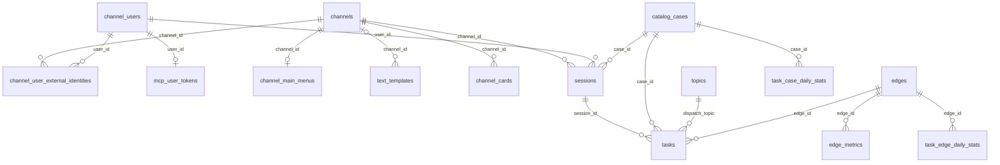
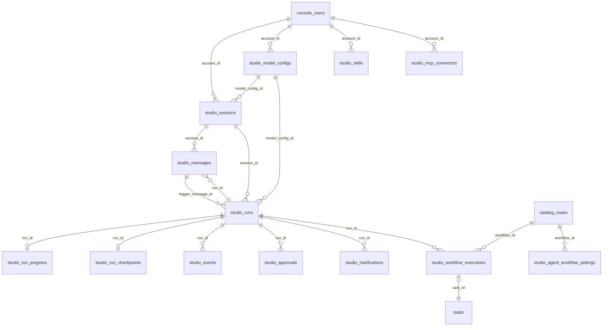
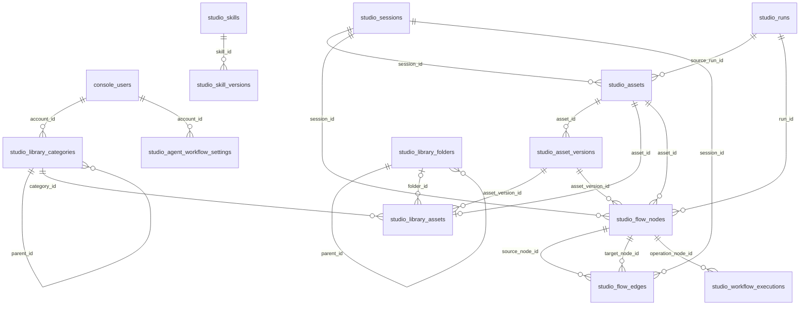

# Pixoma 数据库结构

依据当前启动流程、GORM 模型，以及 2026-09-28 工作区内两份 SQLite 数据库的只读结构查询整理。业务数据库支持 SQLite、MySQL、PostgreSQL；默认 SQLite 文件为 `data/app.db`。首次启动数据库固定为 `data/bootstrap.db`，使用 SQLite。当前 `app.db` 有 40 张业务表，`bootstrap.db` 有 1 张表；其中 `studio_library_folders` 是升级后保留的旧表。下文类型采用 Go 模型类型；`string` 的长度和数据库类型由 GORM 标签决定，`[]byte` 存为 BLOB，`time.Time` 存为时间值。`PK` 表示主键，`UK` 表示唯一索引，`IDX` 表示普通索引，`NN` 表示模型声明非空。没有标记 `NN` 的字段仍可能由业务代码要求赋值。

业务数据库使用 GORM `AutoMigrate`。下列字段之间的连线表示代码中的标识符引用；模型没有声明数据库外键，因此这些连线不表示数据库强制的引用约束。Studio 的 `account_id` 取自 `console_users.id`。JSON 字段的内部结构见文末。

## 首次启动数据库

### `bootstrap_meta`

保存一条 `id=singleton` 的首次启动记录，位于 `bootstrap.db`。

- `id` (`string`, PK, 长度 32)：固定记录标识。
- `initialized` (`bool`, NN)：首次设置是否完成。
- `admin_username` (`string`, NN, 长度 128)：首次管理员用户名。
- `admin_password_hash` (`string`, NN, TEXT)：首次管理员密码的 bcrypt 哈希。
- `must_change_password` (`bool`, NN)：首次管理员是否必须修改密码。
- `admin_nickname` (`string`, 长度 256)：首次管理员显示名称。
- `admin_email` (`string`, 长度 256)：首次管理员邮箱。
- `admin_avatar_url` (`string`, 长度 512)：首次管理员头像地址。
- `agent_token_hash` (`string`, TEXT)：首次生成的 Agent token 哈希。
- `app_db_driver` (`string`, 长度 32)：业务数据库驱动名称。
- `app_db_dsn` (`string`, TEXT)：业务数据库连接信息。
- `wizard_step` (`string`, 长度 64)：首次设置流程位置。
- `enc_key_b64` (`string`, TEXT)：Base64 编码的 32 字节加密密钥。
- `restart_required` (`bool`, NN)：设置变更后是否需要重新启动。

## 业务数据库：设置与身份

### `platform_settings`

保存一条 `id=singleton` 的业务设置记录，由设置存储组件建表。

- `id` (`string`, PK, 长度 32)：固定记录标识。
- `placement` (`string`, NN, 长度 32)：运行位置配置。
- `db_driver` (`string`, NN, 长度 32)：业务数据库驱动名称。
- `db_dsn` (`string`, NN, TEXT)：业务数据库连接信息。
- `blob_driver` (`string`, NN, 长度 32)：文件存储驱动名称。
- `blob_root` (`string`, TEXT)：本地文件存储根目录。
- `blob_endpoint` (`string`, TEXT)：远程文件存储服务地址。
- `blob_region` (`string`, 长度 64)：远程文件存储区域。
- `blob_bucket` (`string`, 长度 256)：远程文件存储 bucket 名称。
- `blob_access_cipher` (`string`, TEXT)：加密后的文件存储访问密钥。
- `blob_secret_cipher` (`string`, TEXT)：加密后的文件存储私密密钥。
- `comfyui_base_url` (`string`, TEXT)：ComfyUI 服务地址。
- `claim_wait_ms` (`int`)：任务领取等待时间，单位毫秒。
- `lease_seconds` (`int`)：任务租约时长，单位秒。
- `proxy_kind` (`string`, 长度 16)：代理类型。
- `proxy_host` (`string`, TEXT)：代理主机。
- `proxy_port` (`int`)：代理端口。
- `media_max_bytes` (`int64`, NN, 默认 0)：媒体上传大小上限，单位字节。
- `allow_self_registration` (`bool`, NN, 默认 false)：是否允许用户自行注册。
- `default_user_access` (`string`, NN, 长度 32, 默认 `denied`)：新渠道用户的默认访问权限。

### `console_users`

- `id` (`string`, PK, 长度 36)：后台用户标识。
- `username` (`string`, UK, NN, 长度 128)：登录用户名。
- `email` (`*string`, UK, 长度 256)：邮箱；未填写时存储 NULL。
- `nickname` (`string`, 长度 256)：显示名称。
- `avatar_url` (`string`, 长度 512)：头像地址。
- `role` (`string`, NN, 长度 32)：后台角色。
- `enabled` (`bool`, NN)：账号是否启用。
- `must_change_password` (`bool`, NN)：下次登录是否必须修改密码。
- `password_hash` (`string`, NN, TEXT)：密码的 bcrypt 哈希。
- `last_login_at` (`time.Time`)：最近登录时间。
- `created_at` (`time.Time`)：记录创建时间。
- `updated_at` (`time.Time`)：记录更新时间。

### `channels`

- `id` (`string`, PK, 长度 128)：渠道标识。
- `platform` (`string`, NN, 长度 32)：渠道平台类型。
- `name` (`string`, NN, 长度 256)：渠道名称。
- `extra_info` (`string`, TEXT)：渠道补充信息。
- `credential_ciphertext` (`string`, NN, TEXT)：加密后的渠道凭据。
- `enabled` (`bool`, NN, 默认 true)：渠道是否启用。
- `last_check_kind` (`string`, 长度 32)：最近一次连接检查的结果类别。
- `last_check_message` (`string`, TEXT)：最近一次连接检查的信息。
- `last_check_at` (`*time.Time`)：最近一次连接检查时间；未检查时为 NULL。
- `created_at` (`time.Time`, NN)：记录创建时间。
- `updated_at` (`time.Time`, NN)：记录更新时间。

### `channel_users`

- `id` (`string`, PK, 长度 36)：内部渠道用户标识。
- `username` (`string`, 长度 256)：渠道用户名。
- `first_name` (`string`, 长度 256)：用户名字。
- `last_name` (`string`, 长度 256)：用户姓氏。
- `language_code` (`string`, 长度 64)：语言代码。
- `access` (`UserAccess`, NN, 长度 32, 默认 `denied`)：使用权限。
- `last_seen_at` (`time.Time`, NN)：最近活动时间。
- `created_at` (`time.Time`)：记录创建时间。
- `updated_at` (`time.Time`)：记录更新时间。

### `channel_user_external_identities`

- `id` (`string`, PK, 长度 36)：外部身份记录标识。
- `user_id` (`string`, NN, IDX, 长度 36)：引用 `channel_users.id`。
- `channel_id` (`string`, NN, UK 组合字段, 长度 128)：引用 `channels.id`；与 `external_user_id` 联合唯一。
- `external_user_id` (`string`, NN, UK 组合字段, 长度 256)：用户在渠道平台中的标识。
- `profile_json` (`string`, TEXT)：渠道平台返回的用户资料 JSON。
- `last_seen_at` (`time.Time`, NN)：该外部身份最近活动时间。
- `created_at` (`time.Time`)：记录创建时间。
- `updated_at` (`time.Time`)：记录更新时间。

### `mcp_user_tokens`

- `user_id` (`string`, PK, 长度 36)：引用 `channel_users.id`；每位用户保存一条 token 记录。
- `token_hash` (`string`, UK, NN, 长度 64)：用于查找 token 的哈希。
- `token_cipher` (`string`, NN, TEXT)：加密后的 token。
- `created_at` (`time.Time`)：记录创建时间。
- `updated_at` (`time.Time`)：记录更新时间。

## 业务数据库：渠道菜单与工作流

### `channel_main_menus`

- `channel_id` (`string`, PK, 长度 64)：引用 `channels.id`；每个渠道至多一份主菜单。
- `doc_json` (`string`, NN, TEXT)：`MenuTree` 的 JSON 文档。

### `text_templates`

保存全局或渠道级文案模板；`channel_id` 与 `key` 构成联合主键。全局模板的 `channel_id` 为空字符串。

- `channel_id` (`string`, PK 组合字段, NN, 长度 64, 默认空字符串)：渠道级记录引用 `channels.id`；空字符串代表全局模板。
- `key` (`string`, PK 组合字段, 长度 64)：文案模板的名称。
- `template` (`string`, NN, TEXT)：支持变量替换的模板正文。

### `channel_cards`

保留的旧卡片表；当前菜单使用 `channel_main_menus.doc_json`。

- `id` (`string`, PK, 长度 64)：旧卡片标识。
- `channel_id` (`string`, NN, IDX, 长度 64)：引用 `channels.id`。
- `doc_json` (`string`, NN, TEXT)：旧卡片 JSON 文档。

### `catalog_cases`

- `id` (`uint64`, PK, 自增)：工作流目录编号。
- `name` (`string`, NN, 长度 256)：工作流名称。
- `tags_json` (`string`, TEXT)：标签字符串数组的 JSON。
- `cats_json` (`string`, TEXT)：分类字符串数组的 JSON。
- `doc_json` (`string`, NN, TEXT)：完整的 `CaseDocument` JSON。
- `enabled` (`bool`, NN, IDX, 默认 true)：工作流是否启用。
- `created_at` (`time.Time`)：记录创建时间。
- `updated_at` (`time.Time`)：记录更新时间。

### `topics`

- `key` (`string`, PK, 长度 64)：任务分发主题的标识。
- `name` (`string`, NN, 长度 256)：主题名称。
- `enabled` (`bool`, NN)：主题是否启用。
- `created_at` (`time.Time`, NN)：记录创建时间。
- `updated_at` (`time.Time`, NN)：记录更新时间。

### `sessions`

- `id` (`string`, PK, 长度 36)：渠道会话标识。
- `user_id` (`string`, NN, IDX, 长度 36)：引用 `channel_users.id`。
- `channel_id` (`string`, NN, IDX, 长度 128, 默认空字符串)：引用 `channels.id`，参与聊天记录检索索引。
- `chat_external_id` (`string`, NN, IDX, 长度 256, 默认空字符串)：渠道平台中的聊天标识。
- `session_key` (`string`, NN, IDX, 长度 512, 默认空字符串)：会话识别键。
- `status` (`string`, NN, IDX, 长度 32)：会话状态。
- `case_id` (`uint64`, NN)：引用 `catalog_cases.id`。
- `current_input_index` (`int`, NN, 默认 0)：当前收集的输入字段位置。
- `input_keys_json` (`string`, NN, TEXT)：输入字段名称数组的 JSON。
- `draft_json` (`string`, NN, TEXT)：当前草稿的 JSON。
- `created_at` (`time.Time`, NN)：记录创建时间。
- `updated_at` (`time.Time`, NN)：记录更新时间。

### `tasks`

- `id` (`string`, PK, 长度 64)：任务标识。
- `session_id` (`string`, NN, IDX, 长度 36)：引用 `sessions.id`。
- `case_id` (`uint64`, NN)：引用 `catalog_cases.id`。
- `status` (`string`, NN, IDX, 长度 32)：任务状态。
- `edge_id` (`string`, IDX, 长度 128)：执行任务的 `edges.id`。
- `dispatch_topic` (`string`, IDX, 长度 64)：任务分发使用的 `topics.key`。
- `attempts` (`int`, NN, 默认 0)：领取或执行尝试次数。
- `requeue_at` (`time.Time`)：重新进入队列的时间。
- `prompt_id` (`string`, 长度 128)：下游执行请求的提示词标识。
- `input_prefix` (`string`, NN, 长度 512)：任务输入文件的路径前缀。
- `job_ref_json` (`string`, TEXT)：下游任务引用信息的 JSON。
- `lease_until` (`time.Time`)：当前任务租约截止时间。
- `outputs_json` (`string`, NN, TEXT)：任务输出记录数组的 JSON。
- `error_code` (`string`, 长度 128)：任务失败代码。
- `error_message` (`string`, TEXT)：任务失败说明。
- `started_at` (`time.Time`)：任务开始时间。
- `completed_at` (`time.Time`)：任务结束时间。
- `created_at` (`time.Time`, NN)：记录创建时间。
- `updated_at` (`time.Time`, NN)：记录更新时间。

### `edges`

- `id` (`string`, PK, 长度 128)：执行节点标识。
- `name` (`string`, 长度 256)：执行节点名称。
- `description` (`string`, TEXT)：执行节点说明。
- `enabled` (`bool`, NN)：执行节点是否启用。
- `capabilities_json` (`string`, NN, TEXT)：节点能力列表的 JSON。
- `subscribe_topics_json` (`string`, TEXT)：订阅主题标识数组的 JSON。
- `agent_token_enc` (`string`, TEXT)：加密后的 Agent token。
- `hardware_json` (`string`, TEXT)：节点硬件信息的 JSON。
- `hardware_refresh_requested` (`bool`, NN, 默认 false)：是否请求节点更新硬件信息。
- `started_at` (`*time.Time`)：节点最近启动时间。
- `comfy_version` (`string`, 长度 64)：ComfyUI 版本。
- `created_at` (`time.Time`, NN)：记录创建时间。
- `updated_at` (`time.Time`, NN)：记录更新时间。

### `edge_metrics`

- `id` (`uint64`, PK, 自增)：监控记录编号。
- `edge_id` (`string`, IDX, 长度 128)：引用 `edges.id`。
- `metrics_json` (`string`, TEXT)：`Metrics` 的 JSON 快照。
- `collected_at` (`time.Time`, IDX)：指标采集时间。

## 业务数据库：任务统计

### `task_daily_stats`

- `stat_date` (`string`, PK, 长度 10)：统计日期。
- `processed_count` (`int`, NN, 默认 0)：已处理任务数量。
- `succeeded_count` (`int`, NN, 默认 0)：成功任务数量。
- `failed_count` (`int`, NN, 默认 0)：失败任务数量。
- `cancelled_count` (`int`, NN, 默认 0)：取消任务数量。
- `total_duration_ms` (`int64`, NN, 默认 0)：任务总耗时，单位毫秒。
- `total_queue_ms` (`int64`, NN, 默认 0)：排队总耗时，单位毫秒。
- `total_exec_ms` (`int64`, NN, 默认 0)：执行总耗时，单位毫秒。
- `updated_at` (`time.Time`, NN)：统计记录更新时间。

### `task_edge_daily_stats`

- `stat_date` (`string`, PK 组合字段, 长度 10)：统计日期。
- `edge_id` (`string`, PK 组合字段, 长度 64)：引用 `edges.id`。
- `processed_count` (`int`, NN, 默认 0)：该节点已处理任务数量。
- `succeeded_count` (`int`, NN, 默认 0)：该节点成功任务数量。
- `failed_count` (`int`, NN, 默认 0)：该节点失败任务数量。
- `updated_at` (`time.Time`, NN)：统计记录更新时间。

### `task_error_daily_stats`

- `stat_date` (`string`, PK 组合字段, 长度 10)：统计日期。
- `error_code` (`string`, PK 组合字段, 长度 128)：任务错误代码。
- `count` (`int`, NN, 默认 0)：该错误代码出现次数。
- `updated_at` (`time.Time`, NN)：统计记录更新时间。

### `task_case_daily_stats`

- `stat_date` (`string`, PK 组合字段, 长度 10)：统计日期。
- `case_id` (`uint64`, PK 组合字段)：引用 `catalog_cases.id`。
- `count` (`int`, NN, 默认 0)：该工作流处理的任务数量。
- `total_duration_ms` (`int64`, NN, 默认 0)：该工作流任务总耗时，单位毫秒。
- `updated_at` (`time.Time`, NN)：统计记录更新时间。

## 业务数据库：Studio 会话与运行

### `studio_sessions`

- `id` (`string`, PK, 长度 64)：Studio 会话标识。
- `account_id` (`string`, NN, IDX, 长度 64)：会话所属账号标识。
- `title` (`string`, NN, 长度 256)：会话标题。
- `permission_mode` (`string`, NN, 长度 32)：Agent 操作权限模式。
- `model_config_id` (`string`, IDX, 长度 64)：引用 `studio_model_configs.id`。
- `context_summary` (`string`, TEXT)：会话历史内容的摘要。
- `context_summary_through_message_id` (`string`, IDX, 长度 64)：摘要覆盖至的 `studio_messages.id`。
- `status` (`string`, NN, 长度 32)：会话状态。
- `created_at` (`time.Time`)：记录创建时间。
- `updated_at` (`time.Time`, IDX)：记录更新时间，与 `account_id` 组成检索索引。

### `studio_messages`

- `id` (`string`, PK, 长度 64)：消息标识。
- `session_id` (`string`, NN, IDX, 长度 64)：引用 `studio_sessions.id`。
- `account_id` (`string`, NN, IDX, 长度 64)：消息所属账号标识。
- `run_id` (`string`, IDX, 长度 64)：产生消息的 `studio_runs.id`。
- `role` (`string`, NN, 长度 24)：消息角色。
- `content_json` (`[]byte`, NN, BLOB)：消息内容的 JSON。
- `created_at` (`time.Time`, IDX)：记录创建时间，与 `session_id` 组成检索索引。

### `studio_runs`

- `id` (`string`, PK, IDX, 长度 64)：Agent 运行标识。
- `session_id` (`string`, NN, IDX, UK 组合字段, 长度 64)：引用 `studio_sessions.id`。
- `account_id` (`string`, NN, IDX, UK 组合字段, 长度 64)：运行所属账号标识。
- `request_id` (`*string`, UK 组合字段, 长度 128)：请求的去重标识；与 `account_id`、`session_id` 联合唯一。
- `trigger_message_id` (`string`, NN, IDX, 长度 64)：触发运行的 `studio_messages.id`。
- `last_event_sequence` (`uint64`, NN, 默认 0)：最近写入的事件序号。
- `status` (`string`, NN, IDX, 长度 32)：运行状态。
- `model_config_id` (`string`, IDX, 长度 64)：本次运行使用的 `studio_model_configs.id`。
- `skill_ids_json` (`[]byte`, BLOB)：本次运行关联的 Skill 标识数组 JSON。
- `skill_snapshot_json` (`[]byte`, BLOB)：本次运行的 Skill 快照 JSON。
- `asset_ids_json` (`[]byte`, BLOB)：本次运行选中的资源引用 JSON；读取逻辑兼容旧的标识数组。
- `error_code` (`string`, 长度 128)：运行失败代码。
- `error_message` (`string`, TEXT)：运行失败说明。
- `created_at` (`time.Time`, IDX)：记录创建时间，参与运行列表检索索引。
- `started_at` (`time.Time`)：运行开始时间。
- `completed_at` (`time.Time`)：运行结束时间。
- `updated_at` (`time.Time`)：记录更新时间。

### `studio_run_progress`

- `run_id` (`string`, PK, 长度 64)：引用 `studio_runs.id`；每次运行至多一条进度记录。
- `session_id` (`string`, NN, IDX, 长度 64)：引用 `studio_sessions.id`。
- `account_id` (`string`, NN, IDX, 长度 64)：进度所属账号标识。
- `assistant_message_id` (`string`, 长度 64)：正在生成的 `studio_messages.id`。
- `assistant_text` (`string`, TEXT)：已生成的助手文本。
- `reasoning_text` (`string`, TEXT)：已生成的推理文本。
- `tool_calls_json` (`[]byte`, BLOB)：运行中工具调用的 JSON。
- `last_sequence` (`uint64`, NN)：当前进度对应的最近事件序号。
- `updated_at` (`time.Time`)：进度更新时间。

### `studio_run_checkpoints`

- `run_id` (`string`, PK, 长度 64)：引用 `studio_runs.id`；每次运行至多一条检查点记录。
- `data` (`[]byte`, NN, BLOB)：运行恢复所需的检查点数据。
- `updated_at` (`time.Time`)：检查点更新时间。

### `studio_events`

- `id` (`string`, PK, 长度 64)：运行事件标识。
- `run_id` (`string`, NN, IDX, UK 组合字段, 长度 64)：引用 `studio_runs.id`；与 `sequence` 联合唯一。
- `session_id` (`string`, NN, IDX, 长度 64)：引用 `studio_sessions.id`。
- `account_id` (`string`, NN, IDX, 长度 64)：事件所属账号标识。
- `sequence` (`uint64`, NN, IDX, UK 组合字段)：运行内递增序号。
- `type` (`string`, NN, 长度 96)：事件类型。
- `payload` (`[]byte`, NN, BLOB)：完整事件数据。
- `summary_payload` (`[]byte`, BLOB)：用于摘要展示的事件数据。
- `created_at` (`time.Time`)：事件创建时间。

### `studio_approvals`

- `id` (`string`, PK, 长度 64)：操作审批记录标识。
- `run_id` (`string`, NN, IDX, UK 组合字段, 长度 64)：引用 `studio_runs.id`；与 `tool_call_id` 联合唯一。
- `session_id` (`string`, NN, IDX, 长度 64)：引用 `studio_sessions.id`。
- `account_id` (`string`, NN, IDX, 长度 64)：审批所属账号标识。
- `tool_call_id` (`string`, NN, UK 组合字段, 长度 128)：待审批工具调用标识。
- `action` (`string`, NN, 长度 128)：待审批操作名称。
- `description` (`string`, 长度 256)：待审批操作说明。
- `status` (`string`, NN, IDX, 长度 32)：审批状态。
- `resolved_by` (`string`, 长度 64)：作出审批决定的账号标识。
- `created_at` (`time.Time`)：记录创建时间。
- `resolved_at` (`time.Time`)：审批完成时间。
- `updated_at` (`time.Time`)：记录更新时间。

### `studio_clarifications`

- `id` (`string`, PK, 长度 64)：澄清请求标识。
- `run_id` (`string`, NN, IDX, 长度 64)：引用 `studio_runs.id`。
- `session_id` (`string`, NN, IDX, 长度 64)：引用 `studio_sessions.id`。
- `account_id` (`string`, NN, IDX, 长度 64)：请求所属账号标识。
- `question` (`string`, NN, TEXT)：向用户展示的问题。
- `options_json` (`[]byte`, NN, BLOB)：可选回答的 JSON。
- `workflow_json` (`[]byte`, BLOB)：关联工作流信息的 JSON。
- `status` (`string`, NN, IDX, 长度 32)：请求状态。
- `selected` (`string`, 长度 32)：用户选择的选项。
- `answer` (`string`, TEXT)：用户填写的回答。
- `resolved_by` (`string`, 长度 64)：回答问题的账号标识。
- `created_at` (`time.Time`)：记录创建时间。
- `resolved_at` (`time.Time`)：回答提交时间。
- `updated_at` (`time.Time`)：记录更新时间。

### `studio_workflow_executions`

- `id` (`string`, PK, 长度 64)：Studio 工作流执行记录标识。
- `account_id` (`string`, NN, IDX, 长度 64)：执行所属账号标识。
- `session_id` (`string`, NN, IDX, 长度 64)：引用 `studio_sessions.id`。
- `run_id` (`string`, NN, IDX, UK 组合字段, 长度 64)：引用 `studio_runs.id`；与 `tool_call_id` 联合唯一。
- `tool_call_id` (`string`, NN, UK 组合字段, 长度 128)：发起执行的工具调用标识。
- `task_id` (`string`, NN, UK, IDX, 长度 128)：关联的 `tasks.id`。
- `workflow_id` (`string`, NN, IDX, 长度 64)：引用 `catalog_cases.id` 的字符串形式。
- `operation_node_id` (`string`, NN, IDX, 长度 64)：发起工作流的 `studio_flow_nodes.id`。
- `status` (`string`, NN, IDX, 长度 32)：执行状态。
- `error_message` (`string`, TEXT)：执行失败说明。
- `created_at` (`time.Time`, IDX)：记录创建时间。
- `updated_at` (`time.Time`, IDX)：记录更新时间。
- `completed_at` (`time.Time`)：执行结束时间。

## 业务数据库：Studio 资源与画布

### `studio_assets`

- `id` (`string`, PK, 长度 64)：资源标识。
- `session_id` (`string`, NN, IDX, 长度 64)：资源所属的 `studio_sessions.id`。
- `account_id` (`string`, NN, IDX, 长度 64)：资源所属账号标识。
- `name` (`string`, NN, 长度 512)：资源名称。
- `kind` (`string`, NN, IDX, 长度 32)：资源类型。
- `origin` (`string`, NN, IDX, 长度 32)：资源来源。
- `source_run_id` (`string`, IDX, 长度 64)：产生资源的 `studio_runs.id`。
- `current_version` (`int`, NN)：当前资源版本号。
- `library_saved_at` (`time.Time`)：资源保存至资料库的时间。
- `created_at` (`time.Time`)：记录创建时间。
- `updated_at` (`time.Time`)：记录更新时间。

### `studio_asset_versions`

- `id` (`string`, PK, 长度 64)：资源版本标识。
- `asset_id` (`string`, NN, IDX, UK 组合字段, 长度 64)：引用 `studio_assets.id`；与 `version` 联合唯一。
- `account_id` (`string`, NN, IDX, 长度 64)：资源版本所属账号标识。
- `version` (`int`, NN, UK 组合字段)：资源版本号。
- `mime_type` (`string`, NN, 长度 256)：文件 MIME 类型。
- `blob_key` (`string`, NN, 长度 1024)：文件存储键。
- `size_bytes` (`int64`, NN)：文件大小，单位字节。
- `metadata` (`[]byte`, BLOB)：资源版本补充信息的 JSON。
- `created_at` (`time.Time`)：资源版本创建时间。

### `studio_library_categories`

- `id` (`string`, PK, 长度 64)：资料库分类标识。
- `account_id` (`string`, NN, IDX, 长度 64)：分类所属账号标识。
- `parent_id` (`string`, IDX, 长度 64)：上级 `studio_library_categories.id`；顶层分类不填写。
- `name` (`string`, NN, 长度 256)：分类名称。
- `created_at` (`time.Time`)：记录创建时间。
- `updated_at` (`time.Time`)：记录更新时间。

### `studio_library_folders`（当前 `app.db` 中保留的旧表）

现行代码把旧分类数据复制到 `studio_library_categories`。此表仍存在于当前工作区的数据库中，不在新的建表模型清单内；字段类型以当前 SQLite 表结构为准。

- `id` (`TEXT`, PK)：旧分类标识。
- `account_id` (`TEXT`, NN, IDX)：旧分类所属账号标识。
- `parent_id` (`TEXT`, IDX)：上级旧分类标识。
- `name` (`TEXT`, NN)：旧分类名称。
- `created_at` (`DATETIME`)：旧记录创建时间。
- `updated_at` (`DATETIME`)：旧记录更新时间。

### `studio_library_assets`

- `id` (`uint64`, PK, 自增)：资料库资源记录编号。
- `account_id` (`string`, NN, IDX, UK 组合字段, 长度 64)：记录所属账号标识；与 `asset_id` 联合唯一。
- `asset_id` (`string`, NN, IDX, UK 组合字段, 长度 64)：引用 `studio_assets.id`。
- `asset_version_id` (`string`, NN, 长度 64)：引用 `studio_asset_versions.id`。
- `category_id` (`string`, IDX, 长度 64)：引用 `studio_library_categories.id`。
- `folder_id` (`TEXT`, IDX；仅当前 `app.db` 的旧字段)：迁移前引用 `studio_library_folders.id`；迁移代码将其值转入 `category_id` 后清空。
- `created_at` (`time.Time`)：保存至资料库的时间。
- `updated_at` (`time.Time`, IDX)：记录更新时间，参与资料库分页索引。

### `studio_flow_nodes`

- `id` (`string`, PK, 长度 64)：画布节点标识。
- `session_id` (`string`, NN, IDX, 长度 64)：引用 `studio_sessions.id`。
- `account_id` (`string`, NN, IDX, 长度 64)：节点所属账号标识。
- `type` (`string`, NN, 长度 32)：画布节点类型。
- `title` (`string`, NN, 长度 512)：节点标题。
- `body` (`string`, TEXT)：节点文字内容。
- `asset_id` (`string`, IDX, 长度 64)：节点引用的 `studio_assets.id`。
- `asset_version_id` (`string`, IDX, 长度 64)：节点引用的 `studio_asset_versions.id`。
- `asset_version` (`int`)：节点引用的资源版本号。
- `run_id` (`string`, IDX, 长度 64)：节点关联的 `studio_runs.id`。
- `position_x` (`float64`)：节点在画布上的横坐标。
- `position_y` (`float64`)：节点在画布上的纵坐标。
- `sort_order` (`int`, NN, IDX)：节点在会话中的排序位置。
- `created_at` (`time.Time`)：记录创建时间。
- `updated_at` (`time.Time`)：记录更新时间。

### `studio_flow_edges`

- `id` (`string`, PK, 长度 64)：画布连接标识。
- `session_id` (`string`, NN, IDX, 长度 64)：引用 `studio_sessions.id`。
- `account_id` (`string`, NN, IDX, 长度 64)：连接所属账号标识。
- `source_node_id` (`string`, NN, IDX, 长度 64)：起点 `studio_flow_nodes.id`。
- `target_node_id` (`string`, NN, IDX, 长度 64)：终点 `studio_flow_nodes.id`。
- `label` (`string`, 长度 256)：连接标签。
- `created_at` (`time.Time`)：记录创建时间。
- `updated_at` (`time.Time`)：记录更新时间。

## 业务数据库：Studio 能力配置

### `studio_model_configs`

- `id` (`string`, PK, 长度 64)：模型配置标识。
- `account_id` (`string`, NN, IDX, 长度 64)：配置所属账号标识。
- `name` (`string`, NN, 长度 256)：配置名称。
- `protocol` (`string`, NN, IDX, 长度 64)：模型接口协议。
- `base_url` (`string`, NN, TEXT)：模型接口地址。
- `model` (`string`, NN, 长度 256)：模型名称。
- `api_key_cipher` (`string`, NN, TEXT)：加密后的 API key。
- `enabled` (`bool`, NN, 默认 true)：配置是否启用。
- `agent_enabled` (`bool`, NN, IDX, 默认 true)：是否供 Agent 使用。
- `is_default` (`bool`, NN, IDX, 默认 false)：是否为该账号默认模型配置。
- `context_window_tokens` (`int`, NN, 默认 0)：上下文窗口 token 上限。
- `max_input_tokens` (`int`, NN, 默认 0)：输入 token 上限。
- `max_output_tokens` (`int`, NN, 默认 0)：输出 token 上限。
- `thinking_json` (`[]byte`, NN, BLOB)：`ThinkingConfig` 的 JSON。
- `capabilities_json` (`[]byte`, NN, BLOB)：`ModelCapabilities` 的 JSON。
- `created_at` (`time.Time`)：记录创建时间。
- `updated_at` (`time.Time`)：记录更新时间。

### `studio_skills`

- `id` (`string`, PK, 长度 64)：Skill 标识。
- `account_id` (`string`, NN, IDX, 长度 64)：Skill 所属账号标识。
- `name` (`string`, NN, 长度 256)：Skill 名称。
- `description` (`string`, TEXT)：Skill 说明。
- `prompt` (`string`, NN, TEXT)：Skill 指令文本。
- `files_json` (`[]byte`, BLOB)：Skill 文件数组的 JSON。
- `version` (`string`, NN, 长度 255, 默认 `1.0.0`)：当前版本号。
- `enabled` (`bool`, NN, IDX)：Skill 是否启用。
- `created_at` (`time.Time`, IDX)：记录创建时间，与 `account_id` 组成检索索引。
- `updated_at` (`time.Time`)：记录更新时间。

### `studio_skill_versions`

- `skill_id` (`string`, PK 组合字段, 长度 64)：引用 `studio_skills.id`。
- `version` (`string`, PK 组合字段, 长度 255)：该 Skill 的版本号。
- `account_id` (`string`, NN, 长度 64)：版本所属账号标识。
- `name` (`string`, NN, 长度 256)：该版本的 Skill 名称快照。
- `description` (`string`, TEXT)：该版本的说明快照。
- `prompt` (`string`, NN, TEXT)：该版本的指令文本快照。
- `files_json` (`[]byte`, BLOB)：该版本的文件数组 JSON 快照。
- `created_at` (`time.Time`, NN)：版本创建时间。

### `studio_mcp_connectors`

- `id` (`string`, PK, 长度 64)：MCP 连接器标识。
- `account_id` (`string`, NN, IDX, 长度 64)：连接器所属账号标识。
- `name` (`string`, NN, 长度 256)：连接器名称。
- `url` (`string`, NN, TEXT)：MCP 服务地址。
- `credential_cipher` (`string`, NN, TEXT)：加密后的连接凭据。
- `enabled` (`bool`, NN, IDX, 默认 true)：连接器是否启用。
- `policy` (`string`, NN, 长度 32)：连接器使用策略。
- `discovered_tools` (`[]byte`, NN, BLOB)：发现的 MCP 工具列表 JSON。
- `created_at` (`time.Time`, IDX)：记录创建时间，与 `account_id` 组成检索索引。
- `updated_at` (`time.Time`)：记录更新时间。

### `studio_agent_workflow_settings`

- `account_id` (`string`, PK 组合字段, 长度 64)：设置所属账号标识。
- `workflow_id` (`string`, PK 组合字段, 长度 64)：引用 `catalog_cases.id` 的字符串形式。
- `agent_enabled` (`bool`, NN, 默认 false)：该工作流是否允许 Agent 调用。
- `updated_at` (`time.Time`, NN)：设置更新时间。

## JSON 数据结构

以下为数据库 JSON 字段在代码中有明确 Go 类型的主要结构。JSON 内部的键保留代码定义的名称；`omitempty` 字段在没有值时可以缺省。

- `catalog_cases.doc_json` 对应 `CaseDocument`：`id` 为工作流编号，`name` 为名称，`description` 为说明，`preview` 为预览内容，`tags` 与 `categories` 为字符串数组，`routing` 为分发规则，`inputs` 与 `outputs` 为输入和输出字段数组，`bindings` 为 ComfyUI 节点字段映射，`input_schema` 为输入值的 JSON Schema，`workflow_filename` 为工作流文件名。`routing.rules[]` 包含条件 `when` 和目标主题 `topic`；`inputs[]` 包含 `key`、`type`、`required`、`skip_allowed`、`description`、`preview`；`outputs[]` 包含 `key`、`type`、`description`、`media_type`；`bindings` 包含 `workflow`、`inputs`、`outputs`。
- `catalog_cases.tags_json` 与 `catalog_cases.cats_json` 分别保存 `CaseDocument.tags` 和 `CaseDocument.categories`，类型均为字符串数组。
- `channel_main_menus.doc_json` 对应 `MenuTree`：`id` 为渠道标识，`columns` 为菜单列数，`items[]` 为按钮。每个按钮含 `id`、`label`、`action`；`action` 含 `type`、`workflow_id`、`text`、`media`、`url`、`card`。`card` 可继续包含 `text`、`media`、`buttons`。媒体项包含 `kind`、`url`、`caption`。
- `sessions.input_keys_json` 是按收集顺序排列的字符串数组。`sessions.draft_json` 是以输入字段名称为键的 `DraftValue` 对象；每个值包含 `Key`、`Text`、`Number`、`Bool`、`Blob`、`Skipped`。`Blob` 为 `BlobRef`。
- `tasks.job_ref_json` 是 `BlobRef`：`bucket` 为存储 bucket，`key` 为文件键，`mime` 为 MIME 类型，`size` 为字节数。`tasks.outputs_json` 是 `OutputRef` 数组，每项包含 `Key` 和 `Blob`。
- `edges.capabilities_json` 与 `edges.subscribe_topics_json` 均为字符串数组。`edges.hardware_json` 对应 `Hardware`：`cpu_model`、`cpu_cores`、`ram_bytes`、`gpus[]`、`collected_at`；GPU 项包含 `name`、`vram_bytes`。
- `edge_metrics.metrics_json` 对应 `Metrics`：`cpu_usage_percent`、`mem_used_bytes`、`mem_total_bytes`、`mem_usage_percent`、`gpus[]`、`disk_read_bytes_per_sec`、`disk_write_bytes_per_sec`、`collected_at`；GPU 项包含 `name`、`usage_percent`、`vram_used_bytes`、`vram_total_bytes`、`vram_usage_percent`。
- `studio_model_configs.thinking_json` 对应 `ThinkingConfig`：`enabled`、`effort`、`budget_tokens`。`studio_model_configs.capabilities_json` 对应 `ModelCapabilities`：`tools`、`vision`、`image_output`、`streaming`。
- `studio_skills.files_json` 与 `studio_skill_versions.files_json` 均为 `SkillFile` 数组；每项包含 `path`、`content`、`binary`、`directory`。`studio_runs.skill_snapshot_json` 为 `RunSkill` 数组；每项包含 `id`、`name`、`description`、`prompt`、`files`。
- `studio_runs.skill_ids_json` 为字符串数组。`studio_runs.asset_ids_json` 保存 `AssetReference` 数组，每项包含 `asset_id` 和 `asset_version_id`；旧记录也可能是资源标识字符串数组。
- `studio_mcp_connectors.discovered_tools` 为 `MCPTool` 数组；每项包含 `name`、`description`、`input_schema`。
- `studio_clarifications.options_json` 为字符串数组。`studio_clarifications.workflow_json` 为 `WorkflowRequest`，包含 `id`、`name`、`description`、`preview`、`input_schema`、`suggested_inputs`、`submitted_inputs`、`anthropic_output`、`input_fields`；`input_fields[]` 包含 `key`、`type`、`required`、`description`。
- `studio_messages.content_json`、`studio_run_progress.tool_calls_json`、`studio_run_checkpoints.data`、`studio_events.payload`、`studio_events.summary_payload` 和 `studio_asset_versions.metadata` 在持久化层保存原始字节，字段模型没有规定统一的内部结构。
- `channel_user_external_identities.profile_json`、`channel_cards.doc_json` 是外部资料或旧记录文档，当前字段模型没有规定统一的内部结构。

## ER 图

连线表示代码使用的引用关系。`bootstrap_meta` 位于独立数据库；`platform_settings` 是业务数据库中的独立设置记录。两张表没有跨表引用。

### 渠道、工作流与任务

`task_daily_stats` 与 `task_error_daily_stats` 按日期和错误代码汇总任务，不保存单条任务标识。`channel_main_menus.doc_json` 中的 `workflow_id` 与 `catalog_cases.id` 也存在文档内部的引用。

### Studio 会话与运行

Studio 的运行附属记录还各自保存 `session_id` 和 `account_id`，供按会话及账号查询。`studio_workflow_executions.workflow_id` 与 `studio_agent_workflow_settings.workflow_id` 使用工作流编号的字符串形式。

### Studio 资源与画布

`studio_runs.asset_ids_json` 和 `studio_runs.skill_ids_json` 也保存对资源与 Skill 的引用，但这些引用在 JSON 内部，没有单独的关联表。

## 主要组合索引

以下列顺序依据当前 `app.db` 的索引定义。单字段主键、唯一索引和普通索引已在各字段旁标记。

- `channel_user_external_identities.idx_channel_external`：唯一索引，`channel_id`、`external_user_id`。
- `sessions.idx_chat_active`：`channel_id`、`chat_external_id`、`status`。
- `studio_messages.idx_studio_messages_session_created`：`session_id`、`created_at`。
- `studio_runs.idx_studio_runs_request`：唯一索引，`session_id`、`account_id`、`request_id`。
- `studio_runs.idx_studio_runs_trace_page`：`account_id`、`session_id`、`created_at`、`id`。
- `studio_events.idx_studio_events_run_sequence`：唯一索引，`run_id`、`sequence`。
- `studio_approvals.idx_studio_approvals_run_tool`：唯一索引，`run_id`、`tool_call_id`。
- `studio_workflow_executions.idx_studio_workflow_executions_run_tool`：唯一索引，`run_id`、`tool_call_id`。
- `studio_asset_versions.idx_studio_asset_versions_asset_version`：唯一索引，`asset_id`、`version`。
- `studio_library_assets.idx_studio_library_account_asset`：唯一索引，`account_id`、`asset_id`。
- `studio_library_assets.idx_studio_library_page`：`account_id`、`updated_at`、`asset_id`。
- `studio_library_assets.idx_studio_library_category_page`：`account_id`、`category_id`、`updated_at`、`asset_id`。
- `studio_flow_nodes.idx_studio_flow_nodes_session_order`：`session_id`、`sort_order`。
- `studio_skills.idx_studio_skills_account_created`：`account_id`、`created_at`。
- `studio_mcp_connectors.idx_studio_mcp_connectors_account_created`：`account_id`、`created_at`。

## 建表与迁移来源

- 业务数据库的主模型清单：`apps/pixoma/internal/application/app.go` 中的 `applicationModels()`，以及 `internal/studio/infrastructure/persistence/gorm_repository.go` 中的 `Models()`。
- 执行节点模型：`internal/platform/appboot/boot.go` 的 `MigrateEdges`。
- 业务设置表：`internal/settings/infrastructure/store.go` 中的 `NewStore()`。
- 文案模板表：`internal/channels/infrastructure/persistence/text_store.go` 中的 `NewStore()`。
- 首次启动表：`internal/platform/bootstrap/bootstrap.go` 中的 `Open()`。
- Studio 额外迁移：`MigrateLibraryCategories()` 读取旧表 `studio_library_folders`，将分类转入 `studio_library_categories`；`MigrateSkillVersions()` 为现有 Skill 补齐版本记录。当前工作区的 `app.db` 仍有旧表 `studio_library_folders` 与旧字段 `studio_library_assets.folder_id`，已在上文单独列出。
