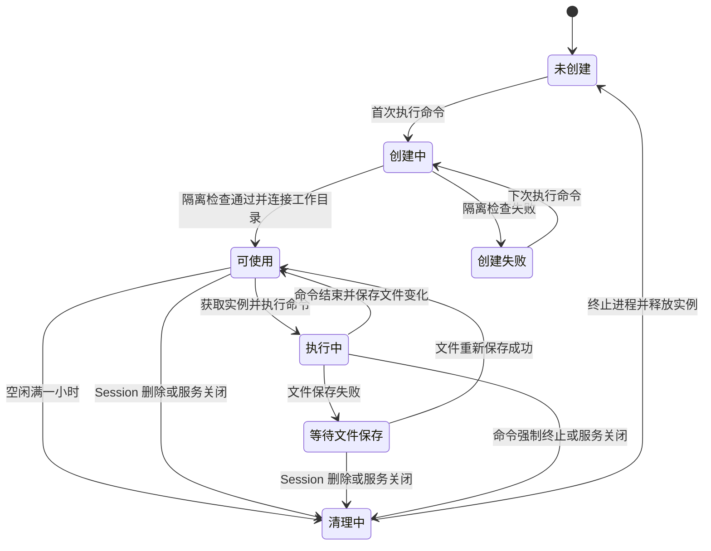
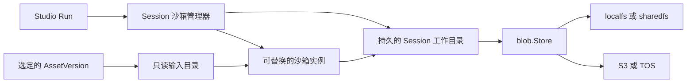

# Studio Agent 沙箱方案（第二版）

## 目标与适用范围

Studio 仅在 Agent 调用需要运行程序的工具时创建沙箱。当前 Studio 尚未注册本机命令工具；新增命令工具时，工具注册和权限检查必须接入现有执行路径。普通对话、现有的 Asset 工具、Workflow 工具及远程 MCP 调用继续使用各自的执行路径。沙箱绑定 `(accountID, sessionID)`，同一 Session 的多个 Run 复用存活的沙箱。

Session 工作目录独立于沙箱实例。沙箱空闲一小时后终止；工作目录持续存在，直到 Session 数据按产品保留规则删除。实例重建后继续使用该目录。用户选择独立沙箱服务时，执行工具仍使用相同的 Session、Asset 和工作目录语义。

现有 `blob.Store` 通过 `Put/Get/Check` 管理对象；`localfs`、`sharedfs`、S3、TOS 使用同一组逻辑 key。Studio 的 AssetVersion 是不可变版本，Run 读取选定的 AssetVersion。上传文件的 Blob key 位于 `studio/{accountID}/uploads/...`，其他 Session Asset 常位于 `studio/{accountID}/{sessionID}/...`。因此，工作目录使用独立的存储区域，沙箱不得获得整个 Blob 根目录的写入权限。

## 工作目录与沙箱实例

### Session 工作目录

每个 Session 拥有专属的可写工作目录。目录保存 Agent 通过命令创建、编辑、删除的文件，也保存跨 Run 继续使用的文件。目录身份由 `(accountID, sessionID)` 决定，路径由 Pixoma 生成，不能使用模型提供的字符串拼接宿主路径。

`localfs` 部署将目录放在 Pixoma 的持久数据目录中；`sharedfs` 部署将目录放在所有执行宿主均可访问的共享目录中，并使用专属的工作目录前缀。两种部署都只向沙箱开放当前 Session 的目录。选定的 AssetVersion 通过单独的只读输入目录提供。沙箱可以直接访问工作目录，不需要在每个 Run 前后复制目录。

S3 或 TOS 部署仍使用本机目录供执行程序读写。Go 服务使用现有 `blob.Store` 保存工作目录的文件内容和目录清单：

1. 同一宿主上的新沙箱直接使用已有目录。需要在另一宿主恢复时，根据数据库记录的最新目录清单读取文件。
2. 每次命令完成后，计算工作目录的文件变化。先将新增及修改文件上传至 `studio-workspaces/{accountID}/{sessionID}/objects/...`，再将新的不可变目录清单上传至同一前缀下的 `manifests/...`；删除通过目录清单记录。
3. 数据库通过 Session 工作目录版本号检查本次提交，并指向新的目录清单。命令结果在提交完成后才确认。上传成功但数据库提交失败的对象不对后续 Run 可见。跨宿主恢复时核对文件的内容校验值。
4. Blob 操作由 Go 服务执行。沙箱内没有 S3、TOS 密钥。工作目录清理任务列出专属前缀下的对象，删除无引用对象。

目录清单记录相对路径、文件类型、大小、内容校验值、执行权限和 Blob key。同步程序读取工作目录内的普通文件与目录；符号链接只记录链接内容，不沿链接读取宿主文件。特殊设备、套接字及超出限制的文件拒绝保存。恢复时再次验证路径，防止路径越界。

当前 S3、TOS 适配器的 `Put` 会把整个对象读入内存。用于工作目录文件和 Asset 发布前，必须改为内存用量有上限的上传方式，并对单文件大小设置明确限制。

本机目录可在沙箱实例异常终止后保留文件。S3/TOS 对另一宿主提供的恢复点是最近一次成功提交的目录清单。命令执行途中宿主及其本机目录同时不可用时，尚未提交的文件变化无法恢复。独立沙箱若不能保证实例意外终止后文件仍在，应使用持久卷；仅使用文件传送时，跨实例恢复只能保证最近一次成功提交的文件。需要在任意时刻承受宿主存储故障的部署，应提供沙箱服务可直接访问的持久文件系统。

### 沙箱实例

一个 Session 同时最多关联一个活动沙箱实例。实例保存执行中的进程、临时目录及执行环境；这些内容随实例终止而清除。Session 工作目录中的文件持续存在。命令工具只有在自身及其派生进程全部结束后才提交工作目录并返回；持续运行的后台任务需要单独的受控工具和文件保存规则。

「活动」指执行工具获取沙箱、提交命令或命令仍在运行。每次活动将空闲过期时间延长至一小时后。普通文字回复不延长沙箱有效期。命令运行期间不按空闲时间清理；单次命令另受执行时长限制。等待审批或补充信息期间，实例可以自然过期；继续执行时重新创建并连接工作目录。

沙箱过期只改变实例状态。工作目录和已保存的目录清单不随实例过期删除。

## 执行与存储接口

`SandboxProvider` 负责创建实例、执行命令、检查状态、延长有效期、终止实例，以及向远端实例传送文件。提供方声明是否支持宿主目录、持久卷和文件传送；能力检查发生在创建实例前。隔离条件无法满足时，命令工具返回错误，不能直接在 Pixoma 主进程中执行命令。

`WorkspaceManager` 负责创建或打开 Session 工作目录、保存目录清单、跨宿主恢复和删除目录。它使用 `blob.Store`，并通过数据库记录最新目录清单和版本号。为清理及修复中断上传的文件，`blob.Store` 增加按前缀列出对象和删除对象的方法，由 `localfs`、`sharedfs`、S3、TOS 实现。工作目录的打开、保存和恢复由 `WorkspaceManager` 统一提供；操作系统目录的访问能力由 `SandboxProvider` 提供。

本机 `SandboxProvider` 直接向受限进程开放专属目录。独立沙箱提供方若支持持久卷，工作目录连接到该卷；若提供文件传送能力，则由 `WorkspaceManager` 在实例创建和命令完成时传送文件。两条路径向 Agent 呈现相同的目录位置。使用 S3/TOS Blob 驱动时，提供方卷内的变化仍需在命令完成后提交目录清单。提供方必须声明文件何时完成持久化，Pixoma 据此决定何时确认命令结果。

## 平台执行方式

- macOS：本机提供方通过受限子进程运行命令，按 Session 工作目录生成访问规则，关闭其他用户目录和 Pixoma 的配置、数据库及 Blob 根目录访问。系统自带的 `sandbox-exec` 可以执行配置文件，但其手册已经标记弃用；启动时必须检查命令是否存在，并验证限制规则确实生效。检查失败时只允许使用明确配置的独立沙箱提供方。
- Linux：本机提供方使用用户、挂载、进程和网络命名空间，配合 Landlock、seccomp 及 `no_new_privs` 限制进程，将 Session 工作目录作为唯一可写目录。Landlock 可在无特权进程中限制文件访问；可用的网络限制随内核能力变化。所需内核能力与资源限制均需在启动时探测。所需限制不能执行时，命令工具返回错误。
- Windows：本机提供方使用 AppContainer 限制文件与网络访问，使用 Job Object 限制和终止进程组，并以目录访问控制规则授予 Session 工作目录权限。Go 可以调用这些 Windows API。创建受限进程及运行实际命令都需要通过能力检查；失败时使用已配置的独立提供方。
- 独立沙箱：提供方接入创建、执行、文件访问、有效期和终止接口。提供方自己的最长期限可能短于 Session 的活动时间；到达期限后创建新实例并重新连接工作目录。

所有提供方都应只接收命令所需的环境变量。Pixoma 的数据库、Blob、模型和其他服务密钥始终留在宿主服务中。默认关闭命令进程的外部网络访问；确有网络需求时，由执行工具的权限策略明确授权。

## 文件进入和离开工作目录

Run 创建时已经固定选定的 AssetVersion。执行工具需要某个 Asset 时，Pixoma 读取该固定版本并提供只读输入路径。输入路径不开放账户下的其他 Blob 对象。Agent 修改输入文件时，将新内容写入 Session 工作目录。

命令生成的文件首先属于工作目录。需要成为 Studio Asset 时，应用服务读取指定文件，校验相对路径、大小及媒体类型，再流式写入 `blob.Store`，创建 AssetVersion，并记录来源 Run。文件进入 AssetVersion 后才参与资产库、Flow 和分享等现有流程。目录清单的保存不会自动创建 AssetVersion。

## 租约、配额与清理

管理器在数据库中记录 `(accountID, sessionID)`、提供方、实例 ID、实例代次、持有者、最后活动时间、过期时间、工作目录版本和最新目录清单。获取实例、续期、提交目录清单和清理均检查实例代次。管理器必须确认旧实例的进程已经终止，才能让新实例写入同一工作目录；无法确认时暂停该 Session 的命令执行，防止两个实例同时修改文件。旧实例不能在新实例启动后提交文件或续期。

现有 `CreateRunTurn` 已限制同一 Session 只有一个活动 Run。管理器仍使用 Session 租约处理服务进程之间的创建竞争，以及清理任务和恢复任务之间的竞争。本机提供方必须确保宿主服务退出时受限进程随之终止。服务启动时检查租约和提供方实际实例，回收没有有效租约的实例；当前 Run 的恢复继续遵守既有的 Run 状态规则。

每个实例限制进程数量、执行时长和输出字节数，并在提供方能够强制执行时限制 CPU 与内存。若执行策略要求的资源限制无法强制执行，该提供方不可用。每个工作目录限制文件数量、单文件大小及总容量；全局与账户级别限制活动实例数量。达到限制时，执行工具返回可诊断错误。清理任务只终止过期且没有执行命令的实例。Session 删除时先停止命令，再删除实例和工作目录；删除失败时记录待处理状态并继续清理。

## 中断与恢复

- 文件提交失败：命令工具返回保存失败，保留可用的工作目录；实例仍可访问时也保留实例。管理器暂停该 Session 的后续命令，直到文件提交成功。
- 服务在命令执行中退出：既有 Run 恢复规则决定 Run 状态。本机目录保留；再次启动后先终止旧实例，再检查目录中尚未提交的变化，保存完成后才允许新命令。
- 实例意外终止：同一宿主直接使用保留的工作目录；另一宿主使用数据库指向的目录清单恢复。没有持久卷的独立提供方只能恢复最近一次成功提交的文件。
- 清理任务与新命令并发：实例代次和 Session 租约决定所有权。清理任务无法确认旧进程已终止时，暂停新命令并保留工作目录。

## 完成条件

- 普通 Studio 对话不创建沙箱；首次执行命令才创建实例。同一 Session 后续命令使用存活实例。
- 一小时空闲过期后，旧实例及其进程全部终止；新实例可以读取原 Session 工作目录中的已保存文件。
- `localfs`、`sharedfs`、S3、TOS 均能保存工作目录。S3/TOS 的命令结果仅在目录清单提交成功后确认。
- 沙箱无法读取其他 Session、账户或 Pixoma 服务的文件和密钥。隔离能力缺失时命令执行失败。
- 沙箱文件只有经过应用服务发布后才成为 AssetVersion；Run 读取的输入始终是选定的 AssetVersion。
- 服务重启、审批等待、实例过期和跨宿主恢复均保持 Session 工作目录与实例状态一致。

## 参考

- 当前 Blob 接口：`internal/platform/blob/port.go`。
- 当前 Blob 驱动选择：`internal/platform/blob/factory/factory.go`。
- 当前 Run 并发限制：`internal/studio/infrastructure/persistence/gorm_repository.go` 的 `CreateRunTurn`。
- 当前 Asset 创建和版本读取：`internal/studio/application/executor.go`。
- Windows 的 [AppContainer 创建方式](https://learn.microsoft.com/en-us/windows/win32/secauthz/implementing-an-appcontainer)与 [Job Object 进程管理](https://learn.microsoft.com/en-us/windows/win32/procthread/job-objects)。
- [AWS S3 Files 的挂载条件](https://docs.aws.amazon.com/AmazonS3/latest/userguide/s3-files-mounting.html)及[文件同步行为](https://docs.aws.amazon.com/AmazonS3/latest/userguide/s3-files-synchronization.html)。S3 Files 只适用于其文档列出的 Linux 环境，写入 S3 bucket 存在同步间隔；采用时需以文件系统自身的持久性作为命令完成依据。
