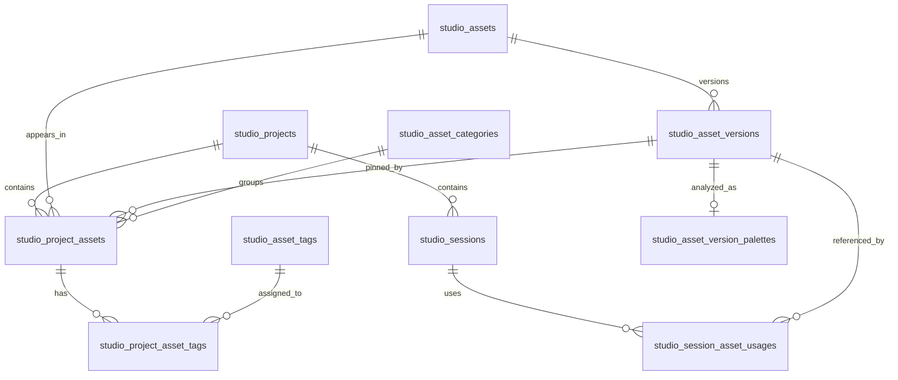

# Pixoma Studio 项目资产库技术方案

## 1. 设计依据

Studio 当前使用 `studio_assets` 和 `studio_asset_versions` 保存文件；Session 产物通过 `studio_assets.session_id` 查询。手动保存到资产库会额外写入 `studio_library_assets`，分类保存在账号范围的 `studio_library_categories`。项目当前使用 `studio_sessions.project_id`，空字符串表示未归属项目。项目访问边界是 `account_id`，现有代码没有独立的项目成员权限表。

新结构让每个可浏览资产都有 `ProjectAsset`。对话产物、上传文件与跨对话引用共用 `Asset` 和 `AssetVersion`；项目整理信息属于 `ProjectAsset`。左侧文件树的六种组织方式由查询生成，项目之下没有额外的文件夹实体。

## 2. 数据含义与约束

- `Asset`：账号拥有的内容身份；同一个 Asset 可加入多个项目。原始名称、资产类型和首次创建时间保存在这里。
- `AssetVersion`：不可变的内容版本，保存 Blob 引用、文件属性和来源时间。编辑或重新生成内容时新增版本。
- `ProjectAsset`：项目中的资产条目。固定版本、展示名称、分类、评分、标签、添加日期和归档时间由此决定。同一账号、同一项目、同一 Asset 只有一个条目。
- `SessionAssetUsage`：对话创建、上传或引用了哪个 AssetVersion。同一 Asset 可与多个 Session 关联。来源标题和操作时间保存在关联记录中，删除 Session 后仍可展示来源。
- `project_id = ''` 是未归属项目的存储值。所有项目相关表使用非空字符串字段，并通过 `account_id + project_id` 查询；非空项目 ID 必须在 `studio_projects` 中属于当前账号。
- `AssetVersion` 内容字段创建后不可修改。文件格式、尺寸、哈希与调色盘属于可重新分析的衍生信息；重新分析不改变 BlobKey、版本号和字节数。

### 2.1 关系

未归属项目没有 `studio_projects` 记录，对应关系由空字符串范围表示。

## 3. 数据库表

### 3.1 `studio_assets`：保留并调整

- 保留：`id` 主键、`account_id`、`name`、`kind`、`origin`、`current_version`、`created_at`、`updated_at`。新增 `creation_key`，保存生成操作 ID 或客户端提交的请求 ID。
- 删除：`session_id`、`source_run_id`、`library_saved_at`。对话与 Run 来源统一由 `studio_session_asset_usages` 表达。
- 唯一索引：`account_id + creation_key`，使相同创建请求只产生一个 Asset。查询索引：`account_id + created_at + id`。同一请求 ID 携带不同内容时返回冲突。
- `current_version` 只表示 Asset 最新版本号。列表和导出读取 `ProjectAsset.asset_version_id`，不会据此自动更换固定版本。

### 3.2 `studio_asset_versions`：保留并增加文件字段

- 原有字段：`id` 主键、`account_id`、`asset_id`、`version`、`mime_type`、`blob_key`、`size_bytes`、`metadata`、`created_at`。
- 新增：`operation_key`，标识产生这个版本的请求；`content_origin`，值为 `upload`、`manual`、`generated`、`workflow`；`format`，保存规范化值，例如 `png`、`jpeg`、`mp4`、`pdf`，未知为 `unknown`；`width_px`、`height_px` 可为空；`sha256` 可为空；`source_created_at`、`source_modified_at` 可为空。
- 约束：`asset_id + version`、`asset_id + operation_key` 分别唯一；`id + asset_id + account_id` 必须与项目条目和来源关系一致。宽高必须同时为正数或同时为空；`size_bytes >= 0`。
- 索引：`account_id + sha256` 用于账号内重复文件查询；`account_id + format` 用于格式统计。`metadata` 继续保存不参与筛选的来源附加数据。
- 文件类型由服务端检查内容。上传请求的扩展名和 `Content-Type` 只作为提示；文件无法核验时使用 `application/octet-stream` 与 `unknown`。上传请求可以传 `File.lastModified`；浏览器没有可靠的原文件创建时间，`source_created_at` 保持空值。

### 3.3 `studio_project_assets`：新建

- `id`：主键，稳定的项目资产条目 ID。
- `account_id`、`project_id`、`asset_id`、`asset_version_id`：均不可为空；未归属项目使用 `project_id = ''`。
- `display_name`：当前项目的展示名称，初始值为 Asset 原始名称。
- `category_id`：空字符串表示未分类；非空时必须指向同一账号及项目的分类。
- `rating`：整数 0～5，0 表示未评分。
- `added_at`、`updated_at`：进入项目和最后整理时间；`archived_at` 可为空。
- 唯一索引：`account_id + project_id + asset_id`。查询索引：`account_id + project_id + archived_at + added_at + id`、`account_id + project_id + category_id + added_at + id`、`account_id + project_id + rating + added_at + id`。
- 写入时检查 `asset_version_id` 属于 `asset_id`，并检查 Asset、AssetVersion 和项目属于同一账号。数据库外键可按现有数据库配置增加；跨表同账号、同项目的校验必须在事务中完成。

### 3.4 `studio_session_asset_usages`：新建

- `id`：主键；`account_id`、`session_id`、`asset_id`、`asset_version_id`、`usage_kind`、`operation_key`、`created_at` 不可为空。
- `usage_kind`：`created`、`uploaded`、`referenced`。工作流和模型生成均使用 `created`，具体来源由 `AssetVersion.content_origin` 区分。
- `run_id`、`message_id` 可为空；`session_title_snapshot`、`operation_label_snapshot` 保存来源信息。
- 唯一索引：`account_id + session_id + operation_key + asset_id + asset_version_id + usage_kind`。相同操作重试时复用记录；另一次引用同一版本会生成独立记录。
- 查询索引：`account_id + session_id + created_at + id`、`account_id + asset_id + created_at`；项目对话分组由该表与 `studio_project_assets` 联查，并对项目资产条目去重。
- 清空或删除 Session 时保留此表及快照，来源链接根据 Session 是否存在决定是否可打开。

### 3.5 `studio_asset_categories`：新建

- `id` 主键；`account_id`、`project_id`、`parent_id`、`name`、`created_at`、`updated_at`。根分类使用 `parent_id = ''`。
- 唯一索引：`account_id + project_id + parent_id + name`。分类名称保存前去除首尾空白；父分类必须属于同一账号和项目；移动分类时校验目标不在自身子树中。
- 删除分类时，其直接资产和子分类移至上一级；若发生同名冲突，整次操作返回错误，不更改任何记录。

### 3.6 `studio_asset_tags` 与 `studio_project_asset_tags`：新建

- `studio_asset_tags`：`id` 主键、`account_id`、`name`、时间字段；`account_id + name` 唯一。标签名称保存前去除首尾空白。
- `studio_project_asset_tags`：`project_asset_id`、`tag_id` 组成主键，另存 `account_id` 便于校验与过滤；关联的标签和项目资产条目必须属于同一账号。
- 索引：`account_id + tag_id + project_asset_id` 支持按标签查找；多个标签同时筛选使用分组与数量比较，避免重复返回项目资产条目。

### 3.7 `studio_asset_version_palettes`：新建

- `asset_version_id` 主键；`account_id`、`status`、`colors_json`、`sample_points_json`、`algorithm_version`、`attempts`、`lease_until`、`next_retry_at`、`analyzed_at`、`error_code`、`updated_at`。
- `status` 为 `pending`、`running`、`ready`、`failed`。`colors_json` 按占比保存至多 10 个 `{hex, ratio}`；视频采样时间以秒数保存在 `sample_points_json`。
- 索引：`status + next_retry_at + lease_until` 供后台任务领取；`account_id + asset_version_id` 供详情查询。
- 创建图片或视频版本时在同一数据库事务中插入 `pending` 记录。服务启动后和任务处理期间扫描待分析记录，通过带状态与租期条件的更新领取任务。进程中断后，租期到期的任务可再次领取；用户点击「重新分析」会重新设置为 `pending`。

### 3.8 `studio_asset_library_preferences`：新建

- `account_id` 主键；`tree_mode` 保存 `asset`、`session`、`category`、`format`、`rating`、`tag`；`last_project_id` 保存最近查看的项目范围；`updated_at`。
- 展开状态、滚动位置与当前筛选由页面维护；树组织方式和最近项目在不同设备间保持一致。最近项目被删除时改为未归属项目。

### 3.9 `studio_blob_write_intents`：新建

- `blob_key` 主键；`account_id`、`created_at`、`expires_at`、`lease_until`。每次由 Studio 独占写入的 Blob 使用全新 key，在调用 `blob.Store.Put` 前记录写入意图。
- 资产与版本的数据库事务同时删除对应意图。事务失败或写入中断时，过期意图保留给清理任务；任务先检查 `studio_asset_versions` 是否引用 BlobKey，再调用 `blob.Store.Delete`，最后删除意图。
- 索引：`expires_at + lease_until`。写入请求须有明确超时，清理任务只领取超过写入超时的意图，并以租期保护并发处理。工作流已存在的共享 Blob 不创建删除意图。

## 4. 写入流程

### 4.1 创建资产

1. 取得当前账号、请求 ID 与 Session。Session 存在时从数据库读取 `project_id`；资产库上传时请求必须明确携带 `project_id`，空字符串代表未归属项目。非空项目 ID 必须属于当前账号。客户端上传和手动创建请求提供稳定的请求 ID。
2. 限制上传字节数，计算 SHA-256，并从内容核验 MIME、规范化格式和可可靠获得的图片尺寸。视频画面尺寸与调色盘交由后台任务读取，上传请求不等待视频解码。
3. 使用唯一 BlobKey 保存内容。新建 `Asset`、首个 `AssetVersion`、`ProjectAsset`、可选的 `SessionAssetUsage`，以及图片或视频的调色盘待分析记录；这些数据库写入在同一事务中提交。事务失败时向调用方返回错误。
4. 数据库写入成功后才返回资产结果、发送资产事件并刷新 Session 面板。创建、编辑和生成操作使用稳定的 `creation_key` 或 `operation_key`；数据库唯一约束保证重试不会产生重复资产或版本。
5. 对本次操作独占的 Blob，数据库写入失败时立即调用新增的 `blob.Store.Delete`。清理成功后删除写入意图；清理失败时保留意图，后台任务按第 3.9 节继续处理并记录错误。工作流已经使用的共享 Blob 不因项目条目写入失败而删除。

`CreateAsset` 与随后手动保存资产库的两次写入由单次事务方法代替。Session 生成、手动文档、上传以及工作流产物都调用这一方法。

### 4.2 版本更新与引用

- 新版本写入 `studio_asset_versions` 并更新 `studio_assets.current_version`。已有 `ProjectAsset.asset_version_id` 保持原值；用户确认「更新项目资产版本」时，只更新当前项目条目的固定版本。
- 创建引用时读取选择的 `asset_version_id`。若目标项目尚无该 Asset 的条目，建立固定到所选版本的 `ProjectAsset`；已有条目时保持其整理信息和固定版本。随后写入 `SessionAssetUsage`，Run 的 `AssetReferences` 仍记录本次选中的版本，保证运行内容稳定。
- `resolveAssetReferences` 使用账号归属和所选版本所属关系校验，结合当前项目条目决定默认版本；不依赖 `Asset.SessionID` 或保存状态。消息、Run 与 Flow 引用继续指向原 Asset ID 和 AssetVersion ID。
- Session 资产面板根据 `SessionAssetUsage` 查询。项目资产库根据 `ProjectAsset` 查询；两处返回相同内容身份。

### 4.3 项目和 Session 变化

- 移动 Session 时，在同一事务中更新 `studio_sessions.project_id`，并为该 Session 关联的全部 Asset 在目标项目建立缺少的条目；目标项目已有条目时保持它的固定版本与整理信息。原项目条目继续保留。
- 删除项目时，在事务中把该项目的 Session 改为未归属项目。先将其分类树移入未归属项目中新建的原项目名称分类下，同名时增加序号；再把项目资产条目移入未归属项目。遇到同一 Asset 已存在时保留未归属项目的条目，删除待移动的重复条目。标签关系随保留条目决定。确认弹窗展示受影响数量。
- 清空或删除 Session 时保留 Asset、AssetVersion、ProjectAsset 和 `SessionAssetUsage`。页面通过来源快照展示对话名称，已删除的对话不提供跳转。
- 归档只设置 `ProjectAsset.archived_at`；历史引用与其他项目条目不受影响。

## 5. 文件属性与调色盘

- 图片使用已有图像解码组件读取尺寸，至少覆盖 PNG、JPEG、GIF、WebP；SVG 通过成熟的解析库取得明确声明的尺寸。视频后台任务将 `blob.Store.Get` 的顺序数据交给 `ffmpeg`，只解码开头 10 秒，最多取得约 0、3、6、9 秒的 4 帧；短视频保存实际取得的帧和采样时点。视频尺寸从解码画面读取。部署环境应提供 `ffmpeg`，启动时检查可用性。
- 图片调色盘忽略完全透明像素；将画面缩小到有上限的采样尺寸，再统计颜色并合并相近颜色，按像素占比输出至多 10 色。视频合并所取画面的颜色分布，每帧权重相同。
- 单个视频任务最多读取 64 MiB、处理 15 秒，同一进程最多同时分析 2 个视频。遇到需要读取超过上限才能解码的文件，记录分析失败并保留资产；上传、格式筛选和导出继续可用。重新分析仍使用相同上限。
- 「添加日期」读取 `ProjectAsset.added_at`。「创建日期」：上传版本读取 `source_created_at`，没有值则留空；Pixoma 创建的内容读取 `Asset.created_at`。「修改日期」：上传版本优先读取 `source_modified_at`，没有值则留空；Pixoma 创建或编辑的版本读取 `AssetVersion.created_at`。所有存储时间使用 UTC，界面按浏览器时区展示。
- 格式下拉选择与「项目 → 格式」树使用 `AssetVersion.format` 的同一规范化值。列表按项目条目所固定的版本筛选，不能用 Asset 最新版本代替。

## 6. 查询与接口

### 6.1 读取接口

- `GET /api/v1/studio/library/projects`：返回当前账号的项目、未归属项目及各自未归档资产数量。
- `GET /api/v1/studio/library/tree?project_id=&mode=asset&cursor=`：按项目和树组织方式读取下一层节点、数量及分页游标。`mode=session|category|format|rating|tag` 返回对应分组；对话分组包含「无来源对话」，已删除对话使用来源标题快照。树计数不受右侧筛选影响。
- `GET /api/v1/studio/library/assets?project_id=&q=&kind=&format=&category_id=&session_id=&rating=&tag_ids=&sort=&limit=&cursor=`：要求显式传 `project_id` 参数；返回 `items`、`total`、`next_cursor`。项目条目、固定版本、分类、标签、评分和调色盘状态在同一项中返回。其他筛选包括尺寸、大小、日期、归档和重复文件。
- `GET /api/v1/studio/library/assets/{projectAssetID}`：返回详情、可见的来源记录及版本列表。`GET /api/v1/studio/sessions/{sessionID}/assets` 按 `SessionAssetUsage` 返回相同的 Asset 与 AssetVersion 身份。
- `GET /api/v1/studio/library/assets/{projectAssetID}/duplicates`：按固定版本的 SHA-256 返回同账号的其他资产，当前项目优先；同一 Asset 在其他项目的条目不视为重复文件。
- `GET /api/v1/studio/library/categories?project_id=`、`GET /api/v1/studio/library/formats?project_id=`、`GET /api/v1/studio/library/preferences`：供分类、格式下拉选择及树设置使用。

项目内列表从 `studio_project_assets` 开始查询，并连接其固定的 `studio_asset_versions`。来源对话与标签筛选使用 `EXISTS`；分类子树筛选先得到分类 ID 集合，分类节点数量包含下级分类资产。列表与总数共用一组条件；树分组对 `project_asset_id` 去重。格式下拉选择也从当前项目条目的固定版本统计。排序最后追加条目 ID，以保证分页稳定。项目归属校验在读取树、列表、详情、下载和所有写入入口执行。

### 6.2 写入接口

- `POST /api/v1/studio/assets/upload`：Session 上传使用 `session_id`；资产库上传显式提供 `project_id`。请求携带稳定的 `request_id`，可传原文件修改时间；响应包含 `project_asset_id`。手动文档创建与编辑同样携带 `request_id`。
- `POST /api/v1/studio/sessions/{sessionID}/assets/references`：提交 `asset_id`、`asset_version_id` 和 `request_id`，在同一事务中建立目标项目条目与 Session 引用，返回原 Asset ID 和 AssetVersion ID。资源选择器和「用于创作」使用此接口。
- `PATCH /api/v1/studio/library/assets/{projectAssetID}`：修改展示名称、分类、评分或归档状态；每次只提交需要变更的字段。
- `PATCH /api/v1/studio/library/assets/{projectAssetID}/version`：确认后更新当前项目固定版本。
- `POST /api/v1/studio/library/assets/{projectAssetID}/projects`：向目标项目添加条目，指定当前选中的固定版本。
- `PUT /api/v1/studio/library/assets/{projectAssetID}/tags`：提交标签 ID 集合；服务端验证账号归属。
- `POST /api/v1/studio/library/assets/batch`：按所选条目执行分类、标签、评分、归档或添加到项目，返回逐项结果。
- `POST /api/v1/studio/library/assets/export`：按所选项目资产条目下载固定版本；单项返回原文件，多项返回 ZIP。文件名冲突时增加序号。
- 分类提供创建、改名、移动和删除接口，所有请求都包含项目范围。`PUT /api/v1/studio/library/preferences` 保存树组织方式和最近查看项目。`POST /api/v1/studio/assets/{assetID}/versions/{versionID}/palette/retry` 请求重新分析。

响应结构删除 `saved_to_library`。旧的手动保存、按账号列出资产库及复制资产到 Session 的接口从路由和前端 API 中移除。详情、列表和 Session 面板使用统一的 `ProjectAsset` 与 `AssetVersion` 类型。

## 7. 代码调整范围

- `internal/studio/domain/model.go`、`repository.go`：定义 `ProjectAsset`、`SessionAssetUsage`、分类、标签、调色盘及筛选条件；删除资产上的旧资产库状态与 Session 单一归属字段。
- `internal/studio/infrastructure/persistence/gorm_repository.go`：新表模型、索引、事务写入、项目移动、清空 Session、列表与树查询；删除 `LibraryAssetRow`、`SaveAssetToLibrary`、`keepLibraryVersion` 及账号级分类查询。
- `internal/studio/application/upload_asset.go`、`manual_assets.go`、`executor.go`、`workflow_reconciler.go`、`service.go`：统一写入与引用流程，来源操作使用稳定 ID；清理复制新 Asset 的引用流程。
- `internal/httpapi/studio/handler.go`：项目资产库接口、项目范围校验、详情响应与批量结果；删除旧保存与导入路由。
- `internal/platform/blob/port.go` 及本地、S3、TOS 实现：增加删除本次操作独占对象的能力。
- `web/admin/src/lib/api/studio.ts`、Studio 资产面板、资产库页面及资源选择器：共享资产身份与固定版本信息；移除手动保存按钮和旧导入操作。
- `apps/pixoma/internal/application/app.go`：注册新表模型与后台调色盘处理；移除资产分类与 Session 项目字段的旧数据迁移调用。`internal/studio/infrastructure/persistence/library_category_migration.go`、`project_migration.go` 及对应旧数据测试从新结构中删除。
- `docs/database-schema.md`：在实现时更新为实际建表字段、索引和关系。本文为本次调整的设计依据。

## 8. 数据结构启用方式

本次启用允许清除受影响的 Studio 数据，不保留旧资产与对话数据。执行前应明确提示管理员并取得数据库备份；备份用于运维恢复，不由新服务读取。

1. 停止 Studio 写入。对 SQLite、MySQL、PostgreSQL 分别执行明确的数据库结构重建操作，删除旧的 Studio 项目、Session、Message、Run、RunProgress、Checkpoint、Event、ContextRequest、ContextEvent、Approval、Clarification、WorkflowExecution、FlowNode、FlowEdge、资产、资产版本、分类及资产库条目。其他业务表和无资产引用的 Studio 配置表保持原状。
2. 删除旧的 `studio_library_assets`、`studio_library_categories` 和残留的 `studio_library_folders`。重新创建 `studio_assets`、`studio_asset_versions` 及本方案新增的表。清除旧 Studio 数据后，现有 Run、Message 与 Flow 不再保留失效的 Asset ID。
3. 使用新 `Models()` 执行 GORM `AutoMigrate`，再校验要求的唯一索引与查询索引。`AutoMigrate` 本身不会负责删除旧表与旧字段；结构重建必须由独立的部署操作完成，正常启动不执行数据转换。
4. 部署后运行集成测试：新建项目、Session、生成与上传资产、跨项目引用、项目删除、Session 清空、分类与筛选、调色盘失败重试，并分别检查 SQLite、MySQL、PostgreSQL 的建表与唯一约束。

正常服务只使用新数据结构。代码中不保留旧表读取、旧接口转发、运行时双写或字段缺失时的转换逻辑。

## 9. 验证要求

- 创建与重试：Asset、首个版本、项目条目及来源记录同时存在；任一数据库写入失败均不返回成功；相同操作重试没有重复条目。
- 固定版本：Asset 新增版本后，已有项目条目、历史 Run 和 Session 引用保持原版本；确认更新只影响指定项目条目。
- 项目变化：移动 Session、删除项目及清空 Session 后，项目视图与来源快照满足第 4.3 节规则。
- 查询一致性：项目、对话、分类、标签、评分、格式、搜索与归档条件叠加时，列表、总数和树节点计数分别符合其查询范围；跨账号 ID 无法读取内容。
- 文件属性：扩展名与内容不一致时使用核验结果；外部文件缺少创建时间时返回空值；不同项目固定不同版本时显示各自版本的尺寸、格式和调色盘。
- 后台分析：图片与视频得到最多 10 色；视频只读取开头 10 秒并遵守读取量与时间上限；分析失败可重试；进程中断后的租期任务可继续处理。音频和文档没有调色盘记录。
- 存储清理：数据库写入失败时删除本次操作独占的 Blob；共享 Blob 在引用失败时保持可用。
